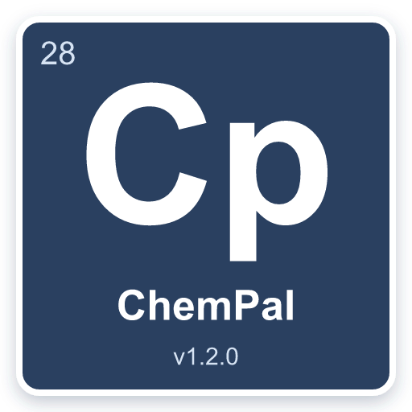

<p align="center">
  
</p>


Open source project aimed at helping amateur chemistry hobbyists find the best deals on chemical reagents. There are plenty of similar services out there for businesses, universities and research institutions, but none are available for individuals and hobbyists. ChemPal only searches suppliers that sell to individuals and ship to residences.

----


## Demo
<p align="center">
  
</p>

----

## Features
- Search up to 26 different suppliers from a single interface
- Search using the reagent names, chemical formulas, CAS numbers or SMILES.
- Search using AST (Abstract Syntax Tree). Examples:
  ```
  (sodium OR potassium) AND (carbonate OR hydroxide)
  "sodium borohydride" AND NOT (triacitoxyborohydride)
  ```
- Advanced cache management allowing for faster query times
- Constrain searches to suppliers that ship to your country
- Compare prices across suppliers in one sortable, filterable table (prices converted to USD so different currencies line up)
- Quantities normalized to a common unit, so you can compare price-per-amount fairly no matter how each supplier lists it
- Auto-detected chemical details: CAS, formula, molecular weight, purity/grade, and concentration
- One-click links to SDS, TDS, and COA documents when a supplier provides them
- Works on both Chrome and Firefox, with light and dark themes
- Viewable from popup or in separate browser tab
- [Price tracking](https://github.com/jhyland87/chem-pal/blob/main/public/static/images/demo/price-tracking.png) on all products and variants
- No account creation required to use extension
- No data collection by the developer — see the [Privacy Policy](pages/PRIVACY.md) for exactly what stays local on your device and what is sent to the suppliers you search

----

## Installation
You can install the latest release from the [releases page](https://github.com/jhyland87/chem-pal/releases/latest). Official Chrome Web Store and Firefox Add-ons listings are on the way.

### Chrome
Download the `chem-pal.crx` asset, then go to your Chrome extensions, and click "Load Packed", then select the .crx file and import it.

### Firefox
Download the `chem-pal-firefox.zip` asset, then open `about:debugging#/runtime/this-firefox`, click **Load Temporary Add-on…**, and select the downloaded zip (or its `manifest.json`).

> [!NOTE]
> Temporary add-ons are removed when Firefox restarts — re-load the zip to use
> it again. A permanently installable signed `.xpi` (via addons.mozilla.org) is
> not provided yet.

## Node version

- Make sure youre on node v22.15.0 and npm v10.9.2 or higher (use nvm if needed)

- Windows NVM: Installer is [here](https://github.com/coreybutler/nvm-windows/releases) (i've never tried it)
- OSX: Run `brew install nvm`, then follow the steps about updating your `~/.bash_profile` that it shows you in the output.

After nvm is installed, run:

```bash
nvm install --lts
nvm use --lts
node --version # Should output v22.15.0
```

Install pnpm (package manager)
```bash
npm install -g pnpm
```

## Building the extension

For local development — loading as an unpacked extension:

```bash
git clone https://github.com/jhyland87/chem-pal.git
cd chem-pal
pnpm run setup
pnpm run build
```

Then import the `build/` folder as an unpacked Chrome extension.

For Firefox, build the Firefox variant and load it as a temporary add-on:

```bash
pnpm run build:firefox
```

Then open `about:debugging#/runtime/this-firefox` → **Load Temporary Add-on…**
and select `build-firefox/manifest.json`.

> [!WARNING]
> `pnpm run build` produces a **development** build and includes the MSW
> mock service worker plus source maps. Do **not** submit the output of
> `pnpm run build` to the Chrome Web Store.

For a Chrome Web Store submission bundle, use:

```bash
pnpm run build:prod
```

This runs the production Vite build and packs the extension via
`tools/pack-extension.js`. The resulting artifact is the only build
intended for store submission.

## Development

```bash
# Install dev dependencies
pnpm run setup

# Run unit tests
pnpm run test

# Run the build.
pnpm run build
```