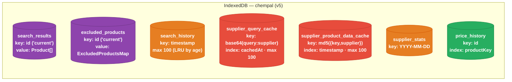

# IndexedDB Object Stores

This document describes the structure of the `chempal` IndexedDB database — every object store, its key, indexes, value shape, size limits, and the functions that read and write it. All access goes through `src/utils/idbCache.ts`.

## Key Concepts

- **One database, `chempal`**: Opened once via a singleton (`getDB()`) using the [`idb`](https://github.com/jakearchibald/idb) wrapper. Current schema version is **5** (`DB_VERSION`). Object stores are created in the `upgrade` callback.
- **Store names are centralized**: Every store name lives in the `IDB_STORE` constant (`src/constants/common.ts`) and is **snake_case** to match the `chrome.storage` key convention (`CACHE`). `IDB_STORE` is an `as const` object rather than a string enum because idb's typed store-name API needs literal string types.
- **IndexedDB vs `chrome.storage`**: Bulk/cached data lives here in IndexedDB (no quota pressure). Lightweight app state — user settings, session query, table state — stays in `chrome.storage` via the `cstorage` wrapper and the `CACHE` enum. The two are separate namespaces.
- **Single-row stores**: `search_results` and `excluded_products` hold everything under one row keyed `"current"`, so a read/write is a full replace of that row.
- **Two LRU-capped caches**: `supplier_query_cache` and `supplier_product_data_cache` each cap at **100** entries, evicting the least-recently-used via an index (`cachedAt` / `timestamp`).
- **Schema version ≠ cache version**: `DB_VERSION` (5) versions the IndexedDB schema. `SupplierCache.CACHE_VERSION` (3), stored in each query-cache entry's `__cacheMetadata.version`, versions the cached *payload* format and evicts stale entries on read — independent of the DB schema version.
- **`clearAllCaches` spares user data**: The bulk clear wipes the six cache/derived stores but **not** `price_history` (user-accumulated data with its own clear action).

## Overview

## Stores

### `search_results`

The most recent search's results, so the table can rehydrate on popup reopen.

| Property | Value |
| --- | --- |
| Key path | `id` (single row keyed `"current"`) |
| Indexes | none |
| Value | `{ id: string; data: Product[] }` |
| Access | `getSearchResults`, `setSearchResults`, `clearSearchResults` |

`setSearchResults` runs `findDuplicateProductIds` and **warns** (does not silently drop) when two products share an identity — a signal that a search fired twice or a supplier emitted duplicates. `clearSearchResults` dispatches the `IDB_SEARCH_RESULTS_CLEARED` window event so the UI can react.

### `search_history`

Past searches, newest-first on read.

| Property | Value |
| --- | --- |
| Key path | `timestamp` (epoch ms) |
| Indexes | none |
| Value | `SearchHistoryEntry` → `{ timestamp, type: "search", query, resultCount, filters?, selectedSuppliers?, data? }` |
| Limit | `MAX_HISTORY_ENTRIES` = 100; oldest entries trimmed via cursor when exceeded |
| Access | `getSearchHistory`, `addSearchHistoryEntry`, `updateSearchHistoryResultCount`, `clearSearchHistory` |

`resultCount` is updated live as results stream in for the entry keyed by its start timestamp.

### `supplier_query_cache`

Whole search-result sets, cached per query + supplier so a repeat search skips the network. Stores **serialized `ProductBuilder` snapshots** (`ProductBuilder.dump()`), not response HTML.

| Property | Value |
| --- | --- |
| Key path | `cacheKey` = `base64(query + supplierName)` (`generateCacheKey`) |
| Indexes | `cachedAt` → `__cacheMetadata.cachedAt` |
| Value | `{ cacheKey, data: unknown[], __cacheMetadata }` |
| `__cacheMetadata` | `{ cachedAt, version, query, supplier, supplierModule, resultCount, limit }` |
| Limit | 100 entries; LRU-evict oldest by `cachedAt` on write |
| Eviction on read | TTL (`cacheTtlMinutes`) and version mismatch (`version !== CACHE_VERSION`) |
| Invalidation | Entry dropped when a new search requests more results than the cached `limit` |
| Access | `getSupplierQueryCacheEntry`, `putSupplierQueryCacheEntry`, `deleteSupplierQueryCacheEntry`, `getAllSupplierQueryCacheEntries`, `clearSupplierQueryCache` |

### `supplier_product_data_cache`

Enriched per-product detail data, keyed by the product's **stable identity** so a product enriched under one search hydrates any other search that surfaces it.

| Property | Value |
| --- | --- |
| Key path | `cacheKey` = `md5({ key: identity, supplier })` (`getProductIdentityKey`; `identity` = `getUniqueProductKey`) |
| Indexes | `timestamp` |
| Value | `{ cacheKey, data: Record<string, unknown>, timestamp }` |
| Limit | 100 entries; LRU-evict oldest by `timestamp` on write |
| Timestamp | Refreshed on cache hit so active entries aren't evicted |
| Access | `getSupplierProductDataCacheEntry`, `putSupplierProductDataCacheEntry`, `deleteSupplierProductDataCacheEntry`, `getAllSupplierProductDataCacheEntries`, `clearSupplierProductDataCache` |

### `supplier_stats`

Per-day, per-supplier HTTP/parse counters for the stats panel. Cached responses do **not** increment HTTP counts.

| Property | Value |
| --- | --- |
| Key path | `dateKey` (`"YYYY-MM-DD"`) |
| Indexes | none |
| Value | `{ dateKey, suppliers: Record<supplierName, SupplierDayStats> }` |
| `SupplierDayStats` | `{ searchQueryCount, successCount, failureCount, uniqueProductCount, parseErrorCount }` |
| Access | `getSupplierStatsEntry`, `putSupplierStatsEntry`, `getAllSupplierStats`, `deleteSupplierStatsEntries`, `clearSupplierStats` |

`putSupplierStatsEntry` dispatches the `IDB_SUPPLIER_STATS_UPDATED` window event so the stats panel refreshes live during a search.

### `excluded_products`

The user's "Ignore Product" list. Matched by the **same identity** as the product-detail cache, so ignoring a product hides it across searches.

| Property | Value |
| --- | --- |
| Key path | `id` (single row keyed `"current"`) |
| Indexes | none |
| Value | `{ id: string; map: ExcludedProductsMap }` |
| `ExcludedProductsMap` | `Record<md5 identity, { url?, supplier, title?, excludedAt }>` |
| Access | `getExcludedProducts`, `putExcludedProducts`, `clearExcludedProducts` |

### `price_history`

Per-product/per-variant USD price series over time. See [Price Tracking](./price-tracking.md) for the full recording process.

| Property | Value |
| --- | --- |
| Key path | `id` = `${productKey}` (base) or `${productKey}::${variantKey}` (variant) |
| Indexes | `productKey` (fetch a product's base + all variant series in one query) |
| Value | `PriceHistoryEntry` → `{ id, productKey, variantKey?, variantId?, supplier, title, permalink?, points: { t, usd }[], updatedAt }` |
| Access | `getPriceSeries`, `putPriceSeries`, `getPriceSeriesByProduct`, `clearPriceHistory` |

## Bulk Clear & Versioning

- **`clearAllCaches()`** clears, in one transaction: `search_results`, `search_history`, `supplier_query_cache`, `supplier_product_data_cache`, `supplier_stats`, and `excluded_products` — then dispatches `IDB_SEARCH_RESULTS_CLEARED`. `price_history` is intentionally left intact.
- **Schema migrations** run in the `upgrade` callback. Each store is created behind an `objectStoreNames.contains(...)` guard, so bumping `DB_VERSION` adds new stores without touching existing ones. There is no automatic data migration between renamed stores — during beta, clearing the database (`indexedDB.deleteDatabase("chempal")` or DevTools → Application → IndexedDB) rebuilds it fresh.

## Key Files

| File | Responsibility |
| --- | --- |
| `src/utils/idbCache.ts` | Schema (`ChemPalDBSchema`), `getDB()` singleton, and all store CRUD |
| `src/constants/common.ts` | `IDB_STORE` store-name constants; `CACHE` (chrome.storage keys) |
| `src/utils/SupplierCache.ts` | Class wrapper over the two supplier caches; owns `CACHE_VERSION` and key generation |
| `src/helpers/excludedProducts.ts` | `ExcludedProductsMap` shape and the exclusion helpers |
| `src/helpers/productIdentity.ts` | `getProductIdentityKey` — the shared identity used by the product cache and exclusions |
