# Price Tracking

This document details how ChemPal records the price of every product (and each of its variants) over time so a user can see whether a price has gone up or down since they last checked. Prices are captured in **standardized USD**, stored in **IndexedDB**, and surfaced as a trend indicator and sparkline in the product detail panel.

## Key Concepts

- **USD is the stored unit**: Every point is the product's `usdPrice` — the USD anchor computed at build time by `ProductBuilder.build()` via `toUSD()`. Storing USD (not the supplier's local price or the user's display currency) keeps points comparable across time and lets the UI convert to any display currency on the fly via `formatDisplayPrice`.
- **A point is written only when the price changes**: Recording reads the last recorded point for a series and appends a new one **only if the USD value differs** (or the series is brand new). Re-running the same search — even over cached results — adds nothing, so a new point always means the price genuinely moved.
- **One series per purchasable unit**: History is keyed per product **and** per variant. A product with no variants tracks itself; a product with variants tracks each variant (each size/grade the user can actually buy). See [Identity: why unique IDs matter](#identity-why-unique-ids-matter).
- **The base price is deduplicated into its default variant**: A product's headline price is usually its default (first) variant. Recording a standalone base series *and* that variant would duplicate the same history, so the base series is written only when its price isn't already captured by a variant.
- **Independent of caching**: Price tracking is gated solely by its own `trackPriceHistory` setting — it runs whether or not the supplier caches are enabled.
- **Not a cache**: The `price_history` store is user-accumulated data, so it is deliberately **excluded from `clearAllCaches`**. It has its own "Clear price history" button in settings.
- **Bounded per series**: `priceHistoryMaxPoints` caps how many points each series keeps (oldest trimmed first); `0` (the default) means unlimited.

## Recording Flow

Recording is fire-and-forget from the two fetch branches of `useSearch` (`recordProductPrices(products, userSettings)`), never from the session-restore path. Each series is an independent IndexedDB row, so a changed price appends one point and everything else is a no-op.

```mermaid
---
config:
  layout: elk
  htmlLabels: true
  markdownAutoWrap: true
  look: neo
  theme: dark
  elk:
    mergeEdges: true
    nodePlacementStrategy: BRANDES_KOEPF
  flowchart:
    curve: basis
---
flowchart TB
linkStyle default stroke-width:4px;
classDef init fill:#4A90D9,stroke:#2C5F8A,color:#fff,font-weight:bold
classDef idb fill:#E67E22,stroke:#D35400,color:#fff,font-weight:bold
classDef flow fill:#5A7D8B,stroke:#3E5A66,color:#fff
classDef write fill:#27AE60,stroke:#1E8449,color:#fff
classDef skip fill:#D97B2A,stroke:#A35D1F,color:#fff
classDef decision fill:#F5D76E,stroke:#C5A83D,color:#333,font-weight:bold
classDef keygen fill:#1ABC9C,stroke:#148F77,color:#fff
%% Descriptor/annotation nodes — a dashed amber "sticky note" look, deliberately
%% distinct from the solid process/decision nodes.
classDef descriptor fill:#FFF8E1,stroke:#FBC02D,stroke-width:1.5px,color:#5D4037,stroke-dasharray:5 4,font-style:italic


SEARCH["useSearch fetch branches\n(filtered + streaming)"]
REC["recordProductPrices(products, settings)"]
SEARCH --> REC
ENABLED{"trackPriceHistory\n!== false?"}
REC --> ENABLED
NOOP["no-op (tracking disabled)"]
ENABLED -->|"no"| NOOP

COLLECT["collectSeriesInputs(product)"]
ENABLED -->|"yes, per product"| COLLECT

subgraph KeyGen["Series keys"]
direction TB
PK["productKey =\ngetProductIdentityKey(\ncacheKey ?? url ?? title, supplier)"]
VK["variant id =\nproductKey :: discriminator\n(genuine id → title → size → sku)"]
PK --> VK
end
COLLECT --> KeyGen

VARIANTS["variant series first\n(dedup same-id siblings in this pass)"]
KeyGen --> VARIANTS
BASE{"base usdPrice already\ncaptured by a variant?"}
VARIANTS --> BASE
BASEADD["add base series input"]
BASE -->|"no"| BASEADD
BASESKIP["skip base (folded into variant)"]
BASE -->|"yes"| BASESKIP

RECSER["recordSeries(input)\nper series"]
VARIANTS --> RECSER
BASEADD --> RECSER

EXIST{"series exists?\ngetPriceSeries(id)"}
RECSER --> EXIST
CREATE["create series\npoints: [{ t, usd }]"]
EXIST -->|"no"| CREATE
CHANGED{"last point usd\n!== current usd?"}
EXIST -->|"yes"| CHANGED
DEDUP["skip write (unchanged) — dedup"]
CHANGED -->|"no"| DEDUP
APPEND["append { t, usd }\ntrim to newest N\n(if maxPoints > 0)"]
CHANGED -->|"yes"| APPEND

PH[("price_history\nkey: id\nindex: productKey")]
CREATE -->|"put"| PH
APPEND -->|"put"| PH
EXIST -.->|"read"| PH

%% ── Descriptor notes: plain-English descriptions pinned next to key nodes ──
D_SEARCH("A user runs a search — every product it returns is checked for a price change")
D_ENABLED("Users can switch tracking off, or clear it, in Settings")
D_KEYS("Each product and variant needs one stable, unique key — otherwise their histories collide")
D_BASE("A product's headline price is just its default variant, so it isn't recorded twice")
D_CHANGED("The heart of it: a point is saved only when the price actually moved")
D_PH("One IndexedDB row per product or variant holds the whole price series")
D_SEARCH ~~~ SEARCH
D_ENABLED ~~~ ENABLED
D_KEYS ~~~ KeyGen
D_BASE ~~~ BASE
D_CHANGED ~~~ CHANGED
D_PH ~~~ PH

class SEARCH,REC init
class COLLECT,VARIANTS,RECSER flow
class PK,VK keygen
class ENABLED,BASE,EXIST,CHANGED decision
class CREATE,APPEND,BASEADD write
class NOOP,DEDUP,BASESKIP skip
class PH idb
class D_SEARCH,D_ENABLED,D_KEYS,D_BASE,D_CHANGED,D_PH descriptor
%% Hide the connector lines for the descriptor notes (they're the last 6 links).
linkStyle 20,21,22,23,24,25 stroke-width:0px,stroke:transparent
```

## Data Model

The `price_history` object store (IndexedDB `chempal` database, `IDB_STORE.PRICE_HISTORY`) holds one row per product-or-variant series. It mirrors the single-row-holds-an-array pattern used elsewhere, so a dedup check is a single read + conditional write. The `productKey` index lets the UI pull a product's base row plus all of its variant rows in one query.

| Field | Type | Notes |
| --- | --- | --- |
| `id` | `string` | Series id — `${productKey}` (base) or `${productKey}::${variantKey}` (variant). Key path of the store. |
| `productKey` | `string` | Product identity, shared by the base row and every variant row. Indexed. |
| `variantKey` | `string?` | Variant discriminator used in the id (genuine variant id, else title/size). Absent on the base row. |
| `variantId` | `string?` | The variant's own supplier id when it is genuinely per-variant — lets a variant be looked up by its exact id. |
| `supplier` | `string` | Supplier display name (kept so history renders without a live product). |
| `title` | `string` | Product/variant title for display. |
| `permalink` | `string?` | Human-facing link back to the product. |
| `points` | `{ t: number; usd: number }[]` | Observed prices, ascending by time; a point appended on each USD-price change. |
| `updatedAt` | `number` | Epoch ms of the last write to this series. |

## Identity: why unique IDs matter

Price tracking lives or dies on **stable, unique identity** at two levels — the product and the variant. Get it wrong and distinct listings collapse into one series (fake trends) or one listing splits across many (lost history).

### Product identity

The product key is `getProductIdentityKey(product.cacheKey ?? product.url ?? product.title, product.supplier)` (an MD5 of `{ key, supplier }`). `cacheKey` is stamped at parse time from each supplier's `SupplierBase.getUniqueProductKey(item)`. **That key must identify the specific purchasable listing, not a broader grouping.**

The cautionary example is Ambeed. Its API returns three related fields:

| Field | Meaning | Unique per listing? |
| --- | --- | --- |
| `p_id` | the **compound** (≈ CAS) — e.g. one value for "Hyaluronic acid sodium salt" | ❌ shared across brands |
| `p_am` | the **listing** (a brand's offering of that compound; the `?am=` in the URL) | ✅ |
| `pr_id` | the **size variant** (1mg, 5mg, …) within a listing | ✅ globally |

Keying products on `p_id` (the compound) collapsed 8 different brand listings of one compound onto a single identity, which:

- tripped the "duplicate products in search results" detector (`findDuplicateProductIds`),
- made those 8 listings share **one** product-detail cache slot (one brand's data served for another),
- merged their prices into a single, meaningless price-history series.

The fix was to key on **`p_am`** (the listing), which `getUniqueProductKey` now returns. The lesson generalizes: a supplier's "product id" is only a valid identity if it is unique per listing.

### Variant identity

Variants are keyed by a discriminator appended to the product key, chosen in priority order:

1. **the variant's own id**, but only when it's *genuine* — i.e. different from the parent identity. `ProductBuilder.build()` fills unset variant fields from the parent, so siblings routinely inherit the **same** parent `sku`/`id`; an inherited id is ignored.
2. **title** (post-build it always encodes size/grade),
3. **size** (`quantity` + `uom`),
4. **sku** (last resort).

Two safeguards back this up:

- **Same-pass dedup**: within one recording pass, if two variants resolve to the same series id they are deduped — otherwise both prices would be appended to one series and manufacture a fake "trend" on the very first search.
- **Base/variant dedup**: the standalone base series is skipped when its USD price already matches a variant, so a product and its default variant don't double-record the same price.

## Settings

Two optional user settings control tracking (defaults in `config.json`, validated in `typeGuards/common.ts`, edited in the **Price History** section of `SettingsPanelFull`):

| Setting | Type | Default | Meaning |
| --- | --- | --- | --- |
| `trackPriceHistory` | `boolean` | `true` | Master on/off. When off, `recordProductPrices` is a no-op. |
| `priceHistoryMaxPoints` | `number` | `0` | Max points kept per series; `0` = unlimited. Oldest points trimmed first. |

The settings section also exposes a **Clear price history** button (`clearPriceHistory()`), separate from the cache-clear actions so accumulated history isn't wiped by a routine cache clear.

## Display

The expanded product detail panel (`ProductDetailPanel`) loads a product's series via `getProductPriceHistory(product)` and renders, per product and per variant:

- a **trend indicator** from `describeTrend(points)` — a colored glyph plus the signed delta and percent change since the previous point (rising = red, drop = green),
- a dependency-free **inline SVG sparkline** of the series,
- a "No history yet" note for series with fewer than two points.

The product-level summary shows the **default variant's** series (the variant whose price is the product's headline price), consistent with the base/variant dedup above. All values run through `formatDisplayPrice`, so history converts to the user's currency exactly like the results table.

## Dev Console

The `chempal` debug object (dev builds only) exposes read helpers for inspection:

- `chempal.getProductPriceHistory(id)` — series for a product **or** a variant. Pass a product id/cacheKey/uuid/_id to get the base + all variant series, or a variant id/sku/title to get just that variant's series.

## Key Files

| File | Responsibility |
| --- | --- |
| `src/helpers/priceHistory.ts` | `recordProductPrices`, `getProductPriceHistory`, `describeTrend`, and the key derivation (`productSeriesKey`, `variantSeriesKey`) |
| `src/utils/idbCache.ts` | `price_history` store schema + CRUD (`getPriceSeries`, `putPriceSeries`, `getPriceSeriesByProduct`, `clearPriceHistory`) |
| `src/components/SearchPanel/hooks/useSearch.ts` | Recording seam — calls `recordProductPrices` from the fetch branches |
| `src/components/SearchPanel/ProductDetailPanel.tsx` | Trend + sparkline UI |
| `src/helpers/productIdentity.ts` | `getProductIdentityKey` (shared product identity) |
| `src/helpers/price.ts` | `formatDisplayPrice` (USD → display currency) |
