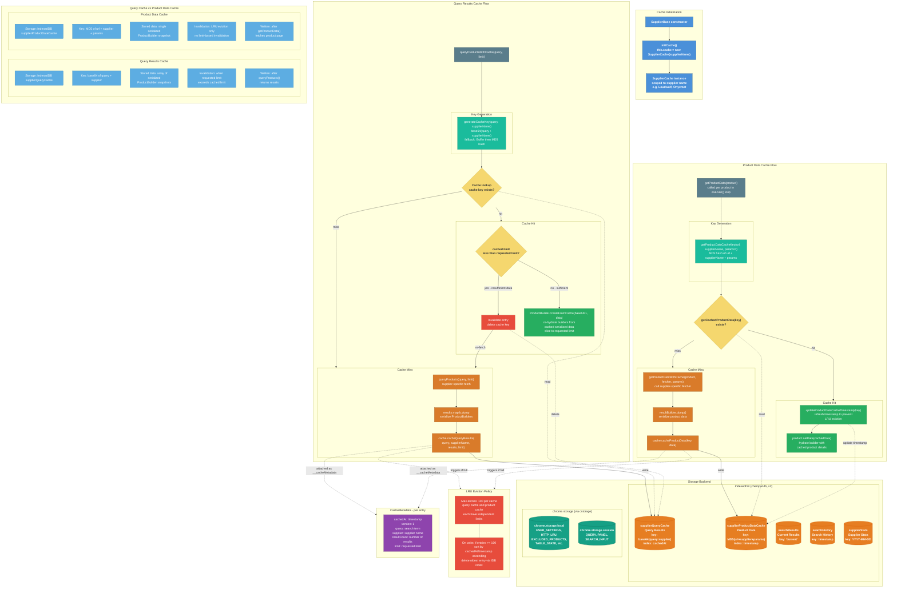

# Search Cache System

This diagram details how ChemPal caches search results and product data using **IndexedDB** to avoid redundant network requests across searches. Lightweight app state remains in `chrome.storage` via the `cstorage` wrapper.

## Key Concepts

- **IndexedDB for cached data**: Query results, product details, search history, and supplier stats are stored in IndexedDB (`chempal` database, version 2) for better performance and no quota pressure on `chrome.storage`
- **chrome.storage for app state**: User settings, table state, excluded products, and session state remain in `chrome.storage.local` / `chrome.storage.session`
- **Two independent supplier caches**: Query results and product details are cached separately in IndexedDB with different key generation strategies
- **LRU eviction**: Both supplier caches cap at 100 entries, evicting the least recently used when full (using IndexedDB indexes on `cachedAt` / `timestamp`)
- **Limit-aware invalidation**: The query cache invalidates entries when a new search requests more results than the cached limit
- **Timestamp refresh on read**: Product data cache updates `timestamp` on hit to prevent active entries from being evicted
- **Serialization**: `ProductBuilder.dump()` serializes builders for storage; `ProductBuilder.createFromCache()` re-hydrates them
- **Optional compression**: `chrome.storage` writes optionally flow through `cstorage` (`src/utils/storage.ts`), which can LZ-compress values at rest via `lz-string` `compressToUTF16` wrapped in an `LzEnvelope` (`{ __lz: 1, d: "..." }`), controlled by `useStorageCompression` in `config.json`. Reads auto-detect the envelope and decompress, falling back to raw values for legacy data. IndexedDB data is **not** compressed via `cstorage`.
- **One-time migration**: `idbMigration.ts` migrates legacy `chrome.storage` cache data to IndexedDB on first run

## Diagram

> [!TIP]
> If the below graphs fail to load, try refreshing without cache (`shift`+`command`+`r` on OSX, `Ctrl`+`F5` on Windows virus)

