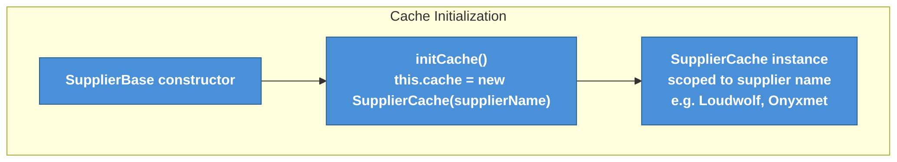
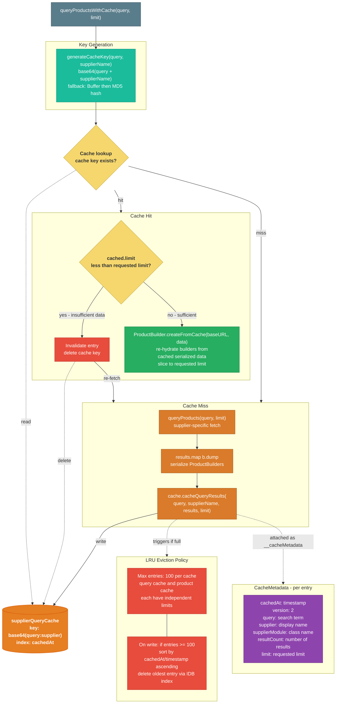
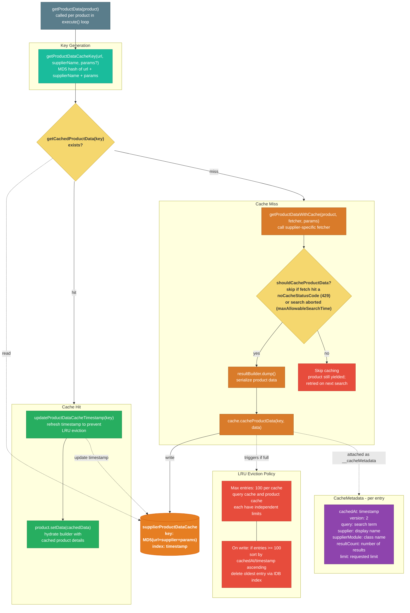
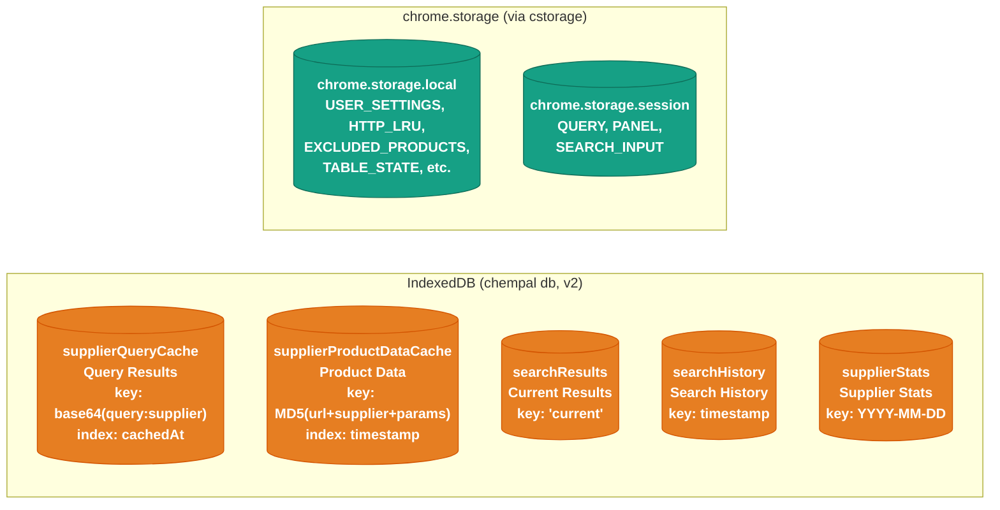

# Search Cache System

This diagram details how ChemPal caches search results and product data using **IndexedDB** to avoid redundant network requests across searches. Lightweight app state remains in `chrome.storage` via the `cstorage` wrapper.

## Key Concepts

- **IndexedDB for cached data**: Query results, product details, search history, and supplier stats are stored in IndexedDB (`chempal` database, version 2) for better performance and no quota pressure on `chrome.storage`
- **chrome.storage for app state**: User settings, table state, excluded products, and session state remain in `chrome.storage.local` / `chrome.storage.session`
- **Two independent supplier caches**: Query results and product details are cached separately in IndexedDB with different key generation strategies
- **LRU eviction**: Both supplier caches cap at 100 entries, evicting the least recently used when full (using IndexedDB indexes on `cachedAt` / `timestamp`)
- **Limit-aware invalidation**: The query cache invalidates entries when a new search requests more results than the cached limit
- **Status-aware product caching**: A product's detail fetch is **not** cached when it hit a status in `noCacheStatusCodes` (default `[429]`) or when the search was aborted by `maxAllowableSearchTime` — the product is still listed, but stays uncached so the next search retries it (`SupplierBase.shouldCacheProductData`)
- **Timestamp refresh on read**: Product data cache updates `timestamp` on hit to prevent active entries from being evicted
- **Serialization**: `ProductBuilder.dump()` serializes builders for storage; `ProductBuilder.createFromCache()` re-hydrates them
- **Optional compression**: `chrome.storage` writes optionally flow through `cstorage` (`src/utils/storage.ts`), which can LZ-compress values at rest via `lz-string` `compressToUTF16` wrapped in an `LzEnvelope` (`{ __lz: 1, d: "..." }`), controlled by `useStorageCompression` in `config.json`. Reads auto-detect the envelope and decompress, falling back to raw values for legacy data. IndexedDB data is **not** compressed via `cstorage`.
- **One-time migration**: `idbMigration.ts` migrates legacy `chrome.storage` cache data to IndexedDB on first run

Whats important to know about the cache is that the cache is keyed by the unique request data, but its not the response object that is cached. Its the standardized search results and the standardized product data that is cached (why cache the entire page when we know exactly what data we need? Easier to cache _that_ data).

There are a few reasons behind having two different types of caches:
1. **We can use cached product data in different search results** - Sometimes search results may share the same data, and this lets us use cached data from one result set in another.
   - Example: If you were to query `sodium borohydride`, theres a possibility that you may find `sodium triacitoxyborohydride` in the results. If you then go and specifically query `sodium triacitoxyborohydride`, any of the cached `sodium triacitoxyborohydride` products that were erronously included in the results for `sodium borohydride` will be what gets included in the results.
2. **This gives us more granular control over the cache** -  Single products can be invalidated and cached without impacting the cache for all products in that search result.

## Diagrams

The two supplier caches are independent, so each flow is its own graph below.
Shared pieces (cache initialization, LRU eviction, and the `__cacheMetadata`
envelope) appear in both. The storage backend that both write to is shown as a
separate reference graph at the end.

### Query Results Cache Flow

### Product Data Cache Flow

### Storage Backend

## Query Cache vs Product Data Cache

The two supplier caches store different things and invalidate differently:

| Aspect | Query Results Cache | Product Data Cache |
| --- | --- | --- |
| Storage | IndexedDB `supplierQueryCache` | IndexedDB `supplierProductDataCache` |
| Key | base64 of `query + supplier` | MD5 of `url + supplier + params` |
| Stored data | Array of serialized `ProductBuilder` snapshots | Single serialized `ProductBuilder` snapshot |
| Invalidation | When requested limit exceeds cached limit | LRU eviction only (no limit-based invalidation) |
| Written | After `queryProducts()` returns results | After `getProductData()` fetches product page |
