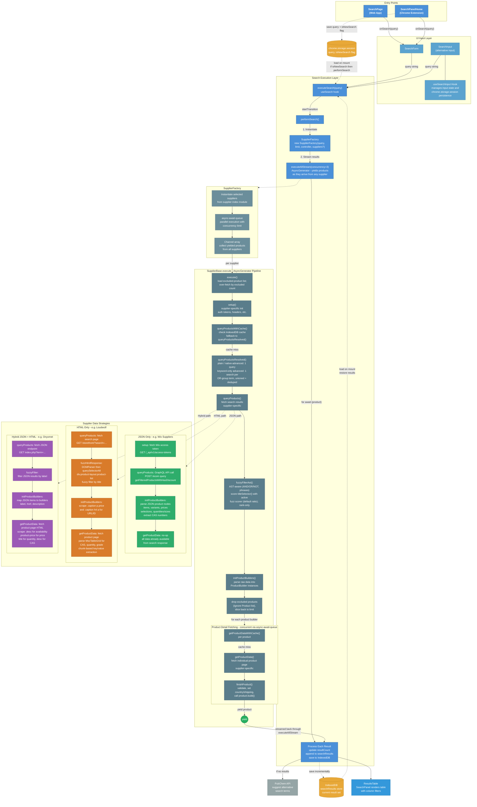

# Search Flow

This diagram details the end-to-end search flow from user input through to rendered results, including how the search execution layer orchestrates multiple suppliers in parallel via streaming.

## Key Concepts

- **Two entry points**: `SearchPage` (web app) and `SearchPanelHome` (Chrome extension) both feed into the same execution pipeline
- **Streaming results**: `SupplierFactory.executeAllStream()` yields products as they arrive from any supplier, enabling incremental UI updates
- **Session persistence**: The Chrome extension persists query state to `chrome.storage.session` (via `cstorage`) and search results to IndexedDB for restore-on-mount
- **Advanced (boolean) search**: queries support `AND`/`OR`/`NOT` and quoted phrases, parsed into an AST by `parseSearchQuery`. `queryProductsResolved()` resolves each supplier's search against that AST — a plain query, or a supplier that can translate the query server-side (`supportsNativeAdvancedSearch`: Wix, Shopify, Magento 2, LiMac), runs a single `queryProducts()`; a keyword-only backend fans out one search per positive OR-group term (`deriveFallbackTerms`, capped at `maxFallbackQueries`) and unions/dedupes the results. The full boolean predicate is always enforced client-side by `fuzzyFilterAst()`
- **Fuzzy matching**: each candidate's `titleSelector()` title is scored with `fuzzball` (default scorer `ratio`, user-selectable via `userSettings.fuzzScorerOverride`). By default `fuzzyFilterAst()` ranks candidates by score rather than hard-cutting at `minMatchPercentage`, and the pipeline keeps the top `limit`; `userSettings.fuzzyFilteringDisabled` turns scoring off entirely
- **Excluded products**: items the user has "Ignore"d (`loadExcludedProductKeys`) are dropped before the detail-fetch phase; `execute()` over-fetches by the excluded count so the removed slots are backfilled
- **Supplier data strategies**: Each supplier implements one of three patterns depending on what the vendor's site exposes:
  - **JSON Only** (e.g. Wix) — GraphQL/REST API provides all product data in the search response; no detail page fetch needed
  - **HTML Only** (e.g. Loudwolf) — Both search results and product details are scraped from HTML pages via `DOMParser`
  - **Hybrid** (e.g. Onyxmet, AladdinSci) — Search results come from a JSON/GraphQL endpoint, but product details require scraping the HTML product page. AladdinSci (Magento 2) fetches each product's page in `getProductData()` to scrape SDS / spec-sheet links, SMILES, IUPAC name, InChIKey, INChI, PubChem CID, molecular weight, and purity
- **Search-time budget**: a supplier may set `maxAllowableSearchTime` (overridable via settings; `SupplierBaseMagento2` defaults to 45s). When it elapses, the `AbortController` cancels outstanding detail fetches and the search yields only the products collected so far — un-enriched products still appear with their basic search-response data, and their incomplete enrichment is not cached so a later search retries it
- **Rate-limit backoff**: when a product-detail fetch hits HTTP 429, Magento/AladdinSci pauses all further detail requests, waits an escalating interval (n, 2n, 3n …), then probes one request before resuming. AladdinSci also throttles detail fetches to 2 concurrent, ≥350 ms apart

## Diagram

