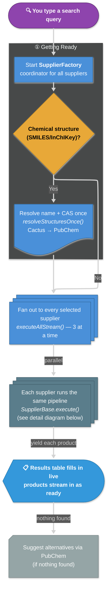

# Search Logic (Plain-English Walkthrough)

A friendly, non-developer overview of what actually happens when someone runs a search.
It names the key classes and methods so a developer can find the code, but the boxes are
written in everyday language. For the deep technical version, see
[search-flow.md](./search-flow.md) and [search-cache-flow.md](./search-cache-flow.md).

## The story in one paragraph

You type a search. The app spins up a coordinator (`SupplierFactory`) that asks **every**
chemical supplier the same question **at the same time**. If your search was a chemical
*structure* (like a SMILES string) instead of a name, the app first looks up the common
name so ordinary suppliers can understand it. Each supplier checks its own memory (cache)
before hitting the internet, finds matching products, keeps the best matches, then fetches
the finer details (price, size, CAS number) for each one. Results are shown the moment
they arrive — you don't wait for the slowest supplier to finish.

## Key ideas (in plain terms)

- **Everything runs in parallel.** Suppliers are queried in batches (3 at a time) and
  products stream onto the screen as they're ready — no waiting for everyone.
- **The app has a memory.** Before making any web request, a supplier asks "have I looked
  this up recently?" A cache hit means instant results and no network call.
- **Two layers of memory.** One remembers *the list of products* for a search term; a
  separate one remembers *the details of each individual product* by its unique ID.
- **Structure searches get translated.** A SMILES/InChIKey structure is turned into a real
  chemical name **and CAS number** once, up front (via NCI Cactus, falling back to PubChem),
  and that translation is shared with every supplier.
- **Each supplier searches the format it understands.** Before searching, the app asks *what
  kind of query is this, and can this supplier read it natively?* A plain name or CAS goes
  straight to the supplier's search. A boolean `AND/OR/NOT` query is either handled natively
  or split into one search per word. A raw chemical structure can't be searched directly, so
  the name/CAS looked up from Cactus/PubChem is used to pick out the genuine matches instead.
- **Results are ranked by relevance, and you control how.** Each product title is scored
  against your query and the list is **sorted best-match-first**, keeping the top results.
  Two knobs in **Settings → Advanced** drive this: the **fuzz scorer** picks the matching
  algorithm (default `ratio`), and **"disable fuzzy filtering"** turns scoring off entirely —
  then results keep the supplier's own order instead of being re-ranked.

## Diagram

Two views of the same flow: a **short overview** for the big picture, then a **supplier
detail** zoom-in. Diamonds are decisions — follow the labelled arrow. **Stacked boxes** =
repeated per supplier / word / product; **slanted boxes** = network calls; **cylinders** =
caches; the **screen-shaped box** = what you see; the **card** = the "nothing found"
fallback.

### Overview



### Each supplier (detail)

Main path runs **top-to-bottom**. The three **horizontal bands** are the only wide
sections — parallel query-format paths, the ranking fork, and per-product detail fetching.

```mermaid
---
config:
  layout: elk
  htmlLabels: true
  markdownAutoWrap: true
  look: neo
  theme: dark
  elk:
    mergeEdges: true
    nodePlacementStrategy: BRANDES_KOEPF
  flowchart:
    curve: basis
    nodeSpacing: 35
    rankSpacing: 45
---

flowchart TB
linkStyle default stroke-width:3px;

subgraph SUPPLIER["② What each supplier does — SupplierBase.execute()"]
direction TB

IGNORE["Load ignored-products list<br/>& over-fetch to backfill hidden slots"]
QCACHE@{ shape: diam, label: "Searched this term recently?<br/><i>queryProductsWithCache()</i>" }
FORMAT@{ shape: diam, label: "What query format — and can<br/>this supplier read it natively?<br/><i>queryProductsResolved()</i>" }

IGNORE --> QCACHE
QCACHE -->|Miss| FORMAT
QCACHE -->|Hit — reuse saved list| DROP

subgraph FORMATS["Query format routing — one path per search"]
direction LR
PLAIN["<b>Plain name / CAS</b><br/>→ search directly"]
BOOLNATIVE["<b>Boolean AND/OR/NOT</b><br/>native (Wix, Shopify,<br/>Magento 2, LiMac)"]
BOOLFAN@{ shape: st-rect, label: "<b>Boolean</b> on keyword-only<br/>supplier → per-word search,<br/>merge & de-dupe" }
STRUCTQ["<b>Structure</b> → match via<br/>resolved name + CAS"]
end

FORMAT --> PLAIN & BOOLNATIVE & BOOLFAN & STRUCTQ
PLAIN & BOOLNATIVE & BOOLFAN & STRUCTQ --> NATIVE

NATIVE@{ shape: lean-r, label: "Search supplier API / site<br/><i>queryProducts()</i>" }
FUZZYQ@{ shape: diam, label: "Fuzzy filtering on?<br/><i>Settings → Advanced</i>" }
NATIVE --> FUZZYQ

subgraph RANKING["Ranking"]
direction LR
SCORE["Rank by relevance<br/><i>fuzzyFilterAst()</i><br/>sort best-first"]
RAWORDER["Keep supplier order<br/><i>fuzzyFilteringDisabled</i>"]
end

FUZZYQ -->|On (default)| SCORE
FUZZYQ -->|Off| RAWORDER
SCORE & RAWORDER --> BUILD

BUILD@{ shape: st-rect, label: "Build products<br/><i>initProductBuilders()</i>" }
SAVEQ@{ shape: cyl, label: "💾 Cache product list<br/>for search term" }
DROP["Drop ignored, trim to limit"]
BUILD --> SAVEQ --> DROP

subgraph DETAILS["Per product — in parallel"]
direction LR
DCACHE@{ shape: diam, label: "Have details<br/>cached?" }
FETCH@{ shape: lean-r, label: "Fetch page / API<br/><i>getProductData()</i>" }
FINISH["Finalize<br/><i>finishProduct()</i>"]
SAVED@{ shape: cyl, label: "💾 Cache by<br/>product ID" }
DCACHE -->|Miss| FETCH --> FINISH --> SAVED
DCACHE -->|Hit| FINISH
end

DROP -->|for each product| DCACHE
FINISH --> YIELD
YIELD@{ shape: f-circ, label: "yield" }

end

classDef decision fill:#E8A838,stroke:#B8841F,color:#000,font-weight:bold
classDef work fill:#5A7D8B,stroke:#3E5A66,color:#fff
classDef native fill:#2EAD6B,stroke:#1F7A4A,color:#fff
classDef storage fill:#D97B2A,stroke:#A35D1F,color:#fff
classDef junction fill:#27AE60,stroke:#1E8449,color:#fff

class QCACHE,DCACHE,FORMAT,FUZZYQ decision
class IGNORE,SCORE,RAWORDER,BUILD,DROP,FINISH,PLAIN,BOOLNATIVE,BOOLFAN,STRUCTQ work
class NATIVE,FETCH native
class SAVEQ,SAVED storage
class YIELD junction
```

## How to read it

1. **Overview diagram** — the full journey in six steps: type query → maybe resolve a
   structure → fan out to suppliers → each runs the pipeline → results stream in → suggest
   alternatives if empty.
2. **Supplier detail diagram** — zoom into the pipeline box. Follow the spine downward;
   the three horizontal bands are the only wide parts (query-format paths, ranking fork,
   per-product detail fetch).
3. **Ranking** (fuzzy diamond) sorts by relevance or keeps the supplier's own order per
   Settings → Advanced.
4. **The two 💾 cylinders** in the detail view are the caches — why a repeat search feels instant.
5. **Results** appear one product at a time as each supplier yields; the overview shows that
   streaming step.
