# Search Logic (Plain-English Walkthrough)

A friendly, non-developer overview of what actually happens when someone runs a search.
It names the key classes and methods so a developer can find the code, but the boxes are
written in everyday language. For the deep technical version, see
[search-flow.md](./search-flow.md) and [search-cache-flow.md](./search-cache-flow.md).

## The story in one paragraph

You type a search. The app spins up a coordinator (`SupplierFactory`) that asks **every**
chemical supplier the same question **at the same time**. If your search was a chemical
*structure* (like a SMILES string) instead of a name, the app first looks up the common
name so ordinary suppliers can understand it. Each supplier checks its own memory (cache)
before hitting the internet, finds matching products, keeps the best matches, then fetches
the finer details (price, size, CAS number) for each one. Results are shown the moment
they arrive — you don't wait for the slowest supplier to finish.

## Key ideas (in plain terms)

- **Everything runs in parallel.** Suppliers are queried in batches (3 at a time) and
  products stream onto the screen as they're ready — no waiting for everyone.
- **The app has a memory.** Before making any web request, a supplier asks "have I looked
  this up recently?" A cache hit means instant results and no network call.
- **Two layers of memory.** One remembers *the list of products* for a search term; a
  separate one remembers *the details of each individual product* by its unique ID.
- **Structure searches get translated.** A SMILES/InChIKey structure is turned into a real
  chemical name **and CAS number** once, up front (via NCI Cactus, falling back to PubChem),
  and that translation is shared with every supplier.
- **Each supplier searches the format it understands.** Before searching, the app asks *what
  kind of query is this, and can this supplier read it natively?* A plain name or CAS goes
  straight to the supplier's search. A boolean `AND/OR/NOT` query is either handled natively
  or split into one search per word. A raw chemical structure can't be searched directly, so
  the name/CAS looked up from Cactus/PubChem is used to pick out the genuine matches instead.
- **Results are ranked by relevance, and you control how.** Each product title is scored
  against your query and the list is **sorted best-match-first**, keeping the top results.
  Two knobs in **Settings → Advanced** drive this: the **fuzz scorer** picks the matching
  algorithm (default `ratio`), and **"disable fuzzy filtering"** turns scoring off entirely —
  then results keep the supplier's own order instead of being re-ranked.

## Diagram

Read it top-to-bottom. The **diamonds are decisions** — follow the labelled arrow that
matches. The shape of each box hints at what it is: **stacked boxes** = one action repeated
many times (per supplier / per word / per product), **slanted boxes** = a network call out
to a supplier, **cylinders** = the caches (memory), the **screen-shaped box** = what you see,
and the **card** at the end = the "nothing found" fallback.

```mermaid
---
config:
  layout: elk
  htmlLabels: true
  markdownAutoWrap: true
  look: neo
  theme: dark
  elk:
    mergeEdges: true
    nodePlacementStrategy: BRANDES_KOEPF
  flowchart:
    curve: basis
    nodeSpacing: 50
    rankSpacing: 55
---

flowchart TB
linkStyle default stroke-width:3px;

START@{ shape: stadium, label: "🔍 You type a search query" }
FANOUT@{ shape: st-rect, label: "Ask every selected supplier at once<br/><i>executeAllStream()</i> — 3 in parallel<br/>skip suppliers that can't ship to you<br/>or don't have permission" }

subgraph Setup["Getting Ready"]
direction TB
FACTORY["Start the search coordinator<br/><b>SupplierFactory</b><br/>it will ask every supplier at once"]
STRUCT@{ shape: diam, label: "Is the query a chemical<br/><b>structure</b> (SMILES/InChIKey)<br/>instead of a name?" }
LOOKUP@{ shape: doc, label: "Look up the common name + CAS<br/><i>resolveStructuresOnce()</i><br/>NCI Cactus → PubChem fallback<br/>shared with every supplier" }
FACTORY --> STRUCT
STRUCT -->|"Yes"| LOOKUP
STRUCT -->|"No — a normal name/CAS"| FANOUT
LOOKUP --> FANOUT
end

START --> FACTORY

subgraph SUPPLIER["What each supplier does — SupplierBase.execute()"]
direction TB
IGNORE["Load your ignored-products list<br/>& over-fetch to backfill hidden slots"]
QCACHE@{ shape: diam, label: "Searched this term recently?<br/><i>queryProductsWithCache()</i>" }
FORMAT@{ shape: diam, label: "What kind of query is this — and can<br/>this supplier read it natively?<br/><i>queryProductsResolved()</i>" }
PLAIN["<b>Plain name or CAS</b><br/>→ search it directly<br/>(most engines accept these)"]
BOOLNATIVE["<b>Boolean AND/OR/NOT</b>, and the supplier<br/>speaks boolean natively (Wix, Shopify,<br/>Magento 2, LiMac) → one native search"]
BOOLFAN@{ shape: st-rect, label: "<b>Boolean AND/OR/NOT</b> on a keyword-only<br/>supplier → one search per word, then<br/>merge & de-dupe <i>(deriveFallbackTerms)</i>" }
STRUCTQ["<b>Chemical structure</b> → can't be searched<br/>raw, so use the name + CAS resolved<br/>from Cactus/PubChem to spot matches<br/><i>resolvedStructures</i>"]
NATIVE@{ shape: lean-r, label: "Search the supplier's own API / site<br/><i>queryProducts()</i><br/>JSON, GraphQL, or scraped HTML" }
FUZZYQ@{ shape: diam, label: "Fuzzy filtering on?<br/><i>(Settings → Advanced)</i>" }
SCORE["Rank by relevance<br/><i>fuzzyFilterAst()</i><br/>score titles with your scorer<br/>(default <i>ratio</i>), sort best-first,<br/>keep the top N"]
RAWORDER["Skip scoring — keep the<br/>supplier's own result order<br/><i>fuzzyFilteringDisabled</i>"]
BUILD@{ shape: st-rect, label: "Build a product for each match<br/><i>initProductBuilders()</i><br/>title, link, unique ID, base price" }
SAVEQ@{ shape: cyl, label: "💾 Cache this product list<br/>for the search term" }
DROP["Drop ignored products,<br/>trim to your result limit"]

IGNORE --> QCACHE
QCACHE -->|"Hit — reuse saved list"| DROP
QCACHE -->|"Miss"| FORMAT
FORMAT --> PLAIN & BOOLNATIVE & BOOLFAN & STRUCTQ
PLAIN & BOOLNATIVE & BOOLFAN & STRUCTQ --> NATIVE
NATIVE --> FUZZYQ
FUZZYQ -->|"On (default)"| SCORE
FUZZYQ -->|"Off — user disabled it"| RAWORDER
SCORE & RAWORDER --> BUILD
BUILD --> SAVEQ --> DROP

subgraph DETAILS["Fill in each product's details — in parallel"]
direction TB
DCACHE@{ shape: diam, label: "Already have this product's details?<br/><i>getProductDataWithCache()</i>" }
FETCH@{ shape: lean-r, label: "Fetch the product page / API<br/><i>getProductData()</i><br/>price, sizes, CAS #, grade, stock" }
FINISH["Finalize the product<br/><i>finishProduct() → build()</i>"]
SAVED@{ shape: cyl, label: "💾 Cache the details<br/>by product ID" }
DCACHE -->|"Miss"| FETCH --> FINISH --> SAVED
DCACHE -->|"Hit — reuse saved details"| FINISH
end

DROP -->|"for each product"| DCACHE
FINISH --> YIELD
YIELD@{ shape: f-circ, label: "yield" }
end

FANOUT ==>|"for each supplier, in parallel"| IGNORE
YIELD ==>|"streamed as soon as ready"| RESULTS

RESULTS@{ shape: curv-trap, label: "📋 Results table fills in live<br/>products appear as each supplier<br/>finishes; newest arrivals added on" }
RESULTS -->|"if nothing found"| SUGGEST
SUGGEST@{ shape: notch-rect, label: "Suggest alternative search<br/>terms via PubChem" }

classDef start fill:#8E44AD,stroke:#5B2C6F,color:#fff,font-weight:bold
classDef setup fill:#4A90D9,stroke:#2C5F8A,color:#fff
classDef decision fill:#E8A838,stroke:#B8841F,color:#000,font-weight:bold
classDef work fill:#5A7D8B,stroke:#3E5A66,color:#fff
classDef native fill:#2EAD6B,stroke:#1F7A4A,color:#fff
classDef storage fill:#D97B2A,stroke:#A35D1F,color:#fff
classDef output fill:#3498DB,stroke:#2176AC,color:#fff,font-weight:bold
classDef fallback fill:#95A5A6,stroke:#6E7B7C,color:#fff
classDef junction fill:#27AE60,stroke:#1E8449,color:#fff

class START start
class FACTORY,LOOKUP,FANOUT setup
class STRUCT,QCACHE,DCACHE,FORMAT,FUZZYQ decision
class IGNORE,SCORE,RAWORDER,BUILD,DROP,FINISH,PLAIN,BOOLNATIVE,BOOLFAN,STRUCTQ work
class NATIVE,FETCH native
class SAVEQ,SAVED storage
class YIELD junction
class RESULTS output
class SUGGEST fallback
```

## How to read it

1. **Getting Ready** — one coordinator (`SupplierFactory`) is created and, if your query is a
   chemical structure, it's translated once into a name + CAS (Cactus → PubChem).
2. **Each supplier** (the big box) runs the same routine independently and in parallel. The two
   diamonds up top decide *whether to hit the cache* and *how to search this query format*.
3. **Ranking** (the fuzzy diamond) sorts results by relevance using your Settings → Advanced
   choices, or preserves the supplier's own order if you've turned fuzzy filtering off.
4. **The two 💾 cylinders** are the caches — the reason a repeated search feels instant.
5. **Results** stream onto the screen (the display-shaped box) one product at a time; if a
   supplier finds nothing, the card at the end suggests alternative terms.
