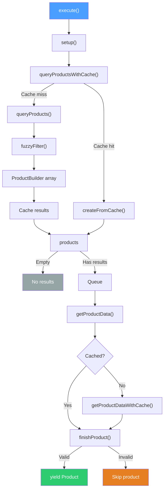
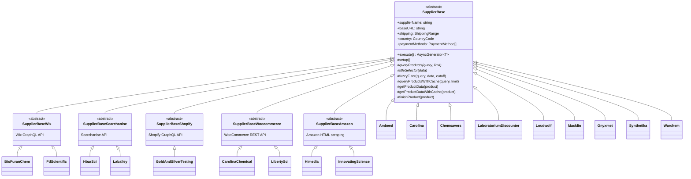
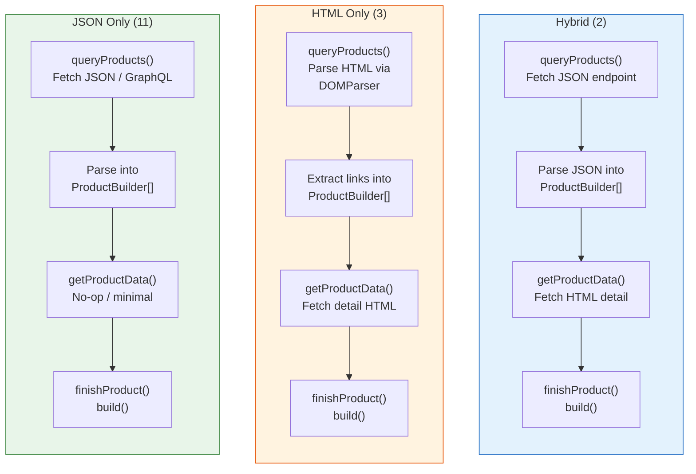
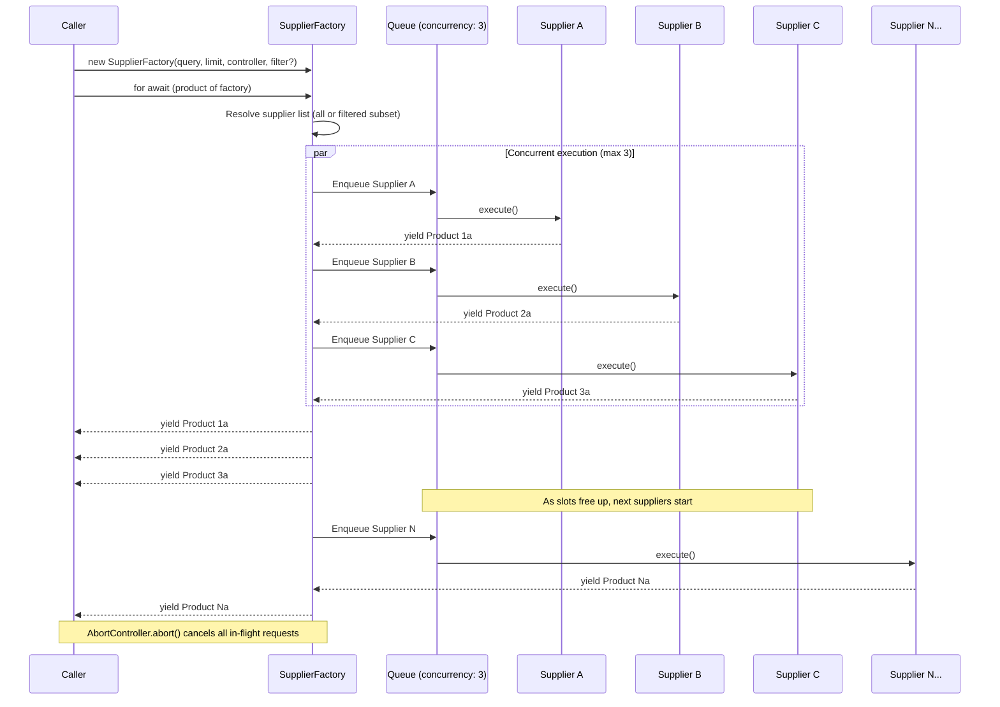
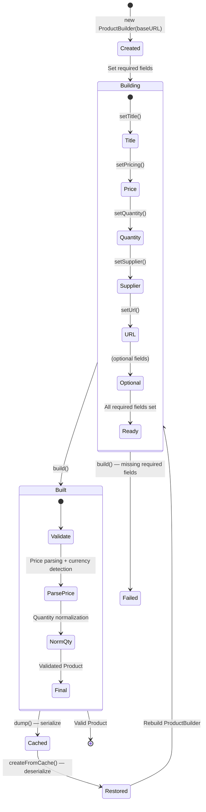

# Supplier Lifecycle

This document provides mermaid diagrams covering the supplier system architecture: the execution lifecycle, class hierarchy, data strategy patterns, and the SupplierFactory orchestration.

> [!TIP]
> If the below graphs fail to load, try refreshing without cache (`shift`+`command`+`r` on OSX, `Ctrl`+`F5` on Windows virus)

## Supplier Execution Lifecycle

The core pipeline defined in `SupplierBase.execute()`. Every supplier follows this flow.

## Class Hierarchy

The inheritance tree for all 18 active suppliers.

## Data Strategy Patterns

How each data strategy flows from search to finished product.

## Supplier Map

All 18 active suppliers by platform, country, and data strategy.

### Direct (SupplierBase) - 9 suppliers
- **Ambeed** - CN - JSON Only
- **Carolina** - US - Hybrid
- **ChemSavers** - US - JSON Only
- **Laboratorium Discounter** - NL - Hybrid
- **Loudwolf** - US - HTML Only
- **Macklin** - CN - JSON Only
- **Onyxmet** - CA - HTML Only
- **Synthetika** - PL - JSON Only
- **Warchem** - PL - HTML Only

### Wix Platform - 2 suppliers
- **BioFuranChem** - US - JSON Only
- **FTF Scientific** - US - JSON Only

### Searchanise Platform - 2 suppliers
- **H-Bar Scientific** - US - JSON Only
- **Lab Alley** - US - JSON Only

### Shopify Platform - 1 supplier
- **Gold and Silver Testing** - US - JSON Only

### WooCommerce Platform - 2 suppliers
- **Carolina Chemical** - US - JSON Only
- **Liberty Science** - US - JSON Only

### Amazon Platform - 2 suppliers
- **HiMedia** - IN - JSON Only
- **Innovating Science** - US - JSON Only

## SupplierFactory Orchestration

How `SupplierFactory` manages parallel supplier execution.

## ProductBuilder Lifecycle

The fluent builder pattern for constructing validated products.

