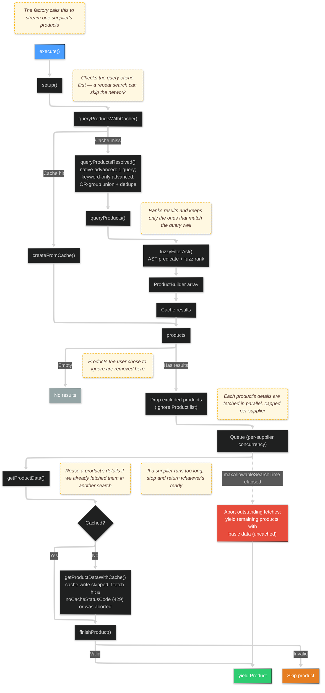
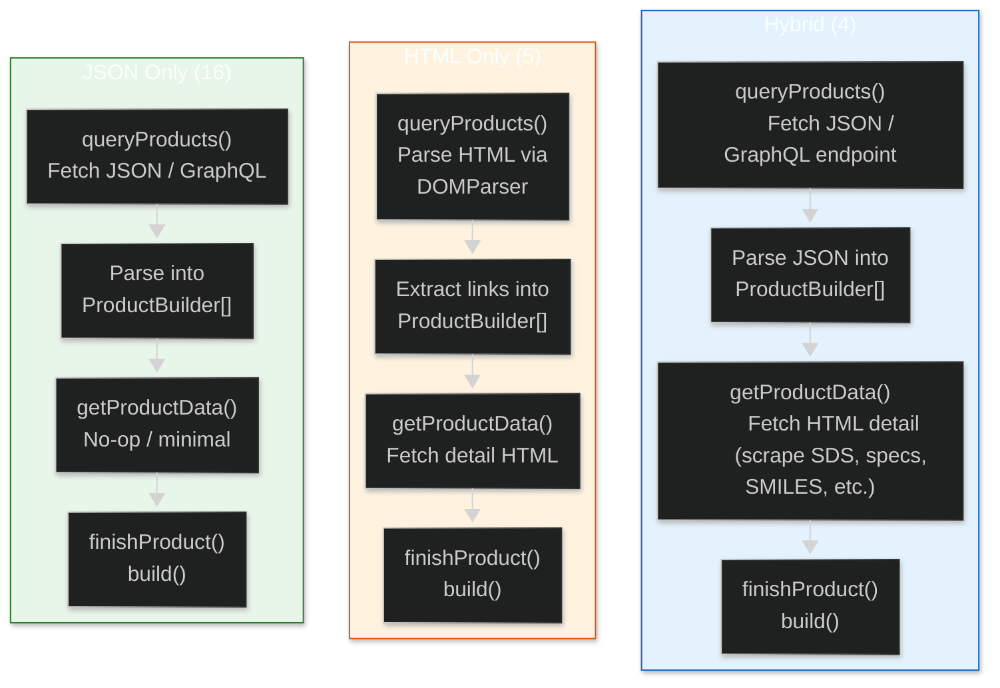
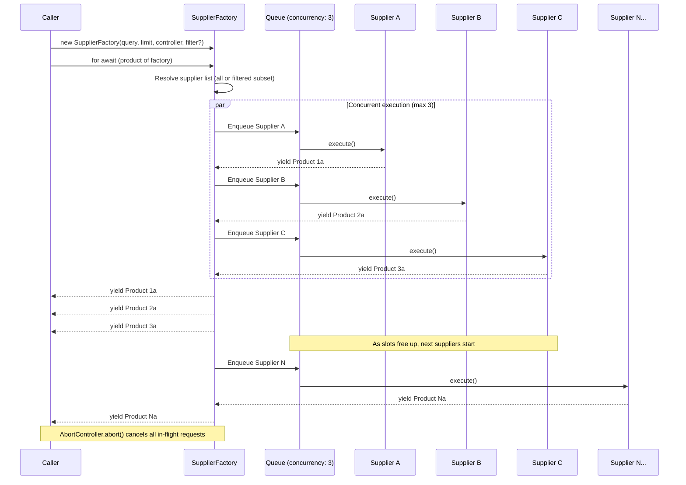
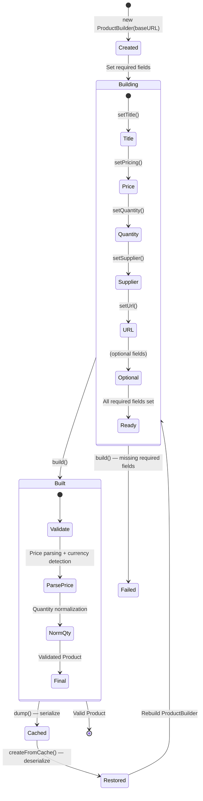

# Supplier Lifecycle

This document provides mermaid diagrams covering the supplier system architecture: the execution lifecycle, class hierarchy, data strategy patterns, and the SupplierFactory orchestration.

## Supplier Execution Lifecycle

The core pipeline defined in `SupplierBase.execute()`. Every supplier follows this flow.

## Class Hierarchy

The inheritance tree for all 25 active suppliers.

```mermaid
classDiagram
    class SupplierBase {
        <<abstract>>
        +supplierName: string
        +baseURL: string
        +shipping: ShippingRange
        +country: CountryCode
        +paymentMethods: PaymentMethod[]
        +execute() AsyncGenerator~T~
        #setup()
        #queryProducts(query, limit)*
        #titleSelector(data)*
        #fuzzyFilterAst(data, minMatchPercentage)
        #queryProductsWithCache(query, limit)
        #queryProductsResolved(query, limit)
        #deriveFallbackTerms()
        #getProductData(product)
        #getProductDataWithCache(product)
        #finishProduct(product)
    }

    class SupplierBaseWix {
        <<abstract>>
        Wix GraphQL API
    }
    class SupplierBaseSearchanise {
        <<abstract>>
        Searchanise API
    }
    class SupplierBaseShopify {
        <<abstract>>
        Shopify GraphQL API
    }
    class SupplierBaseWoocommerce {
        <<abstract>>
        WooCommerce REST API
    }
    class SupplierBaseMagento2 {
        <<abstract>>
        Magento 2 API
    }
    class SupplierBaseAmazon {
        <<abstract>>
        Amazon HTML scraping
    }

    SupplierBase <|-- SupplierBaseWix
    SupplierBase <|-- SupplierBaseSearchanise
    SupplierBase <|-- SupplierBaseShopify
    SupplierBase <|-- SupplierBaseWoocommerce
    SupplierBase <|-- SupplierBaseMagento2
    SupplierBase <|-- SupplierBaseAmazon

    SupplierBase <|-- Ambeed
    SupplierBase <|-- Carolina
    SupplierBase <|-- LaboratoriumDiscounter
    SupplierBase <|-- LiMac
    SupplierBase <|-- Loudwolf
    SupplierBase <|-- Macklin
    SupplierBase <|-- Onyxmet
    SupplierBase <|-- S3Chemicals
    SupplierBase <|-- Synthetika
    SupplierBase <|-- VWR
    SupplierBase <|-- Warchem

    SupplierBaseWix <|-- BioFuranChem
    SupplierBaseWix <|-- FtfScientific

    SupplierBaseSearchanise <|-- Laballey

    SupplierBaseShopify <|-- AsesChem
    SupplierBaseShopify <|-- BVV
    SupplierBaseShopify <|-- GoldAndSilverTesting
    SupplierBaseShopify <|-- TheLabStockroom

    SupplierBaseWoocommerce <|-- AlchemieLabs
    SupplierBaseWoocommerce <|-- AmarisChemicalSolutions
    SupplierBaseWoocommerce <|-- CarolinaChemical
    SupplierBaseWoocommerce <|-- LibertySci

    SupplierBaseMagento2 <|-- AladdinSci

    SupplierBaseAmazon <|-- Himedia
    SupplierBaseAmazon <|-- InnovatingScience
```

## Data Strategy Patterns

How each data strategy flows from search to finished product.

## Supplier Map

All 25 active suppliers by platform, country, and data strategy. Display names match each class's `supplierName` constant — see [Supplier System](../../wiki_files/Supplier-System.md) for the canonical table.

### Direct (SupplierBase) - 11 suppliers
- **Ambeed** - CN - JSON Only
- **Carolina** - US - Hybrid
- **Laboratorium Discounter** - NL - Hybrid
- **LiMac** - LV - HTML Only (FreeFind search + HTML detail; native advanced search)
- **Loudwolf** - US - HTML Only
- **Macklin** - CN - JSON Only
- **Onyxmet** - CA - HTML Only
- **S3 Chemicals** - DE - HTML Only
- **Synthetika** - PL - JSON Only
- **VWR** - US - JSON Only (JSON search + JSON detail enrichment)
- **Warchem** - PL - HTML Only

### Wix Platform - 2 suppliers
- **BioFuran Chem** - US - JSON Only
- **FTF Scientific** - US - JSON Only

### Searchanise Platform - 1 supplier
- **Laballey** - US - JSON Only

### Shopify Platform - 4 suppliers
- **AsesChem** - IN - Hybrid (GraphQL search + HTML detail scrape)
- **BVV** - US - JSON Only
- **Gold and Silver Testing** - US - JSON Only
- **The Lab Stockroom** - US - JSON Only

### WooCommerce Platform - 4 suppliers
- **Alchemie Labs** - US - JSON Only
- **Amaris Chemical Solutions** - US - JSON Only
- **Carolina Chemical** - US - JSON Only
- **LibertySci** - US - JSON Only

### Magento 2 Platform - 1 supplier
- **AladdinSci** - US - Hybrid (GraphQL search + HTML product-page scrape)

### Amazon Platform - 2 suppliers
- **Himedia** - IN - JSON Only
- **Innovating Science** - US - JSON Only

### Deprecated (not exported by `src/suppliers/index.ts`)
- **Akmekem** - Amazon - supplier was removed from Amazon
- **Bunmurra Labs** - Wix - site under reconstruction
- **Chemsavers** - Custom - disabled in the barrel export (reason not noted in code)
- **N2O3** - Custom - site offline since 2026-01-20

## SupplierFactory Orchestration

How `SupplierFactory` manages parallel supplier execution.

## ProductBuilder Lifecycle

The fluent builder pattern for constructing validated products.

