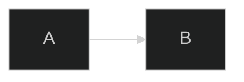
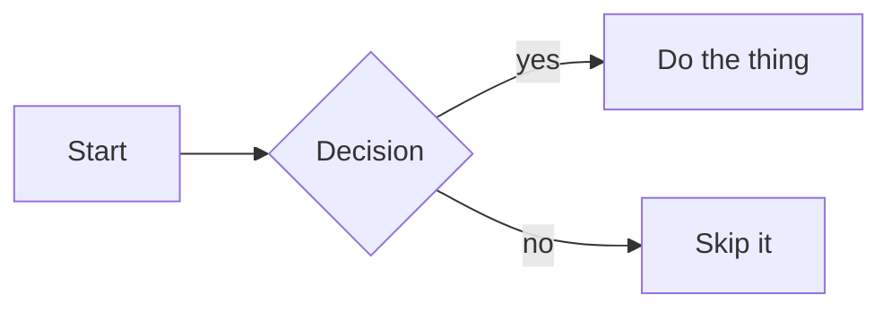

# typedoc-mermaid-plugin

A [TypeDoc](https://typedoc.org) plugin for rendering [Mermaid.js](https://mermaid.js.org)
diagrams in generated documentation. Compatible with **TypeDoc 0.28+**, which
introduced breaking changes to the plugin/event API that the original
`typedoc-plugin-mermaid` does not support.

## Features

- Renders ` ```mermaid ` fenced code blocks in JSDoc comments and project documents.
- Interactive pan & zoom via [svg-pan-zoom](https://github.com/bumbu/svg-pan-zoom)
  (scroll to zoom, click-drag to pan).
- Per-diagram zoom controls (`+`, `−`, Reset) and a full-screen toggle.
- Dark mode support (respects TypeDoc's theme toggle).
- Configurable Mermaid version, container height, and zoom behavior.
- Zero npm dependencies — Mermaid and svg-pan-zoom are loaded from a CDN at runtime.

## Layout

```
typedoc-mermaid-plugin/
├── index.mjs              # Plugin entry point (registered in typedoc.json)
├── mermaid-assets/        # Browser-side assets, copied into <out>/assets/
│   ├── mermaid-diagrams.css
│   ├── mermaid-frontmatter.js  # Dependency-free YAML frontmatter parser
│   └── mermaid-diagrams.js     # Runtime: rendering, controls, pan/zoom
└── README.md
```

`index.mjs` only orchestrates: it registers the option, extracts mermaid code
blocks during markdown parsing, and injects the `<link>`/`<script>` tags into
the final HTML (passing config to the browser script via `data-*` attributes).
The actual rendering logic lives in `mermaid-assets/`.

`mermaid-frontmatter.js` loads first and exposes a single global
(`window.MermaidFrontmatter`); the runtime reads it to parse each diagram's
per-diagram config. Both load as classic scripts so the runtime can read its
`data-*` config via `document.currentScript`.

## Installation

Reference the entry point from the `plugin` array in your TypeDoc config
(paths are relative to the config file):

```jsonc
{
  "plugin": [
    "../plugins/typedoc-mermaid-plugin/index.mjs"
  ],
  "ignoredHighlightLanguages": ["mermaid"]
}
```

Adding `mermaid` to `ignoredHighlightLanguages` stops TypeDoc's syntax
highlighter from choking on the diagram source.

## Configuration

All options live under a single **`mermaidPlugin`** object in your TypeDoc
config. Any key you omit falls back to its default.

```jsonc
{
  "mermaidPlugin": {
    "version": "11",
    "containerHeight": 600,
    "zoomControl": "pan",
    "minZoom": 0.3,
    "maxZoom": 10,
    "disableMaximize": false
  }
}
```

They can also be set on the CLI with dotted keys, e.g.
`--mermaidPlugin.maxZoom 5`.

### Parameters

| Key               | Type      | Default | Description                                                                        |
| ----------------- | --------- | ------- | ---------------------------------------------------------------------------------- |
| `version`         | `string`  | `"11"`  | Mermaid.js CDN version tag — e.g. `"11"`, `"10.9.1"`, or `"latest"`. Kept a string because these values are not always valid numbers. |
| `containerHeight` | `number`  | `600`   | Height of the diagram container, in pixels.                                        |
| `zoomControl`     | `string`  | `"pan"` | How the mouse wheel / trackpad interacts with the diagram: `"pan"` (scroll/drag pans, pinch or ctrl+wheel zooms), `"wheel"` (wheel zooms directly, drag still pans), or `"none"` (static SVG — no pan/zoom and no zoom buttons). Invalid values fall back to `"pan"`. |
| `minZoom`         | `number`  | `0.3`   | Minimum zoom level. Ignored when `zoomControl` is `"none"`.                        |
| `maxZoom`         | `number`  | `10`    | Maximum zoom level. Ignored when `zoomControl` is `"none"`.                        |
| `disableMaximize` | `boolean` | `false` | Hide the full-screen (maximize) button. Independent of `zoomControl` — maximize stays available even when pan/zoom is `"none"`. |

### Per-diagram overrides

Any of the options above (except `version`, which is page-wide) can be set on an
individual diagram through its Mermaid frontmatter, namespaced under
`config.mermaidPlugin`. These merge over the global config for that one diagram:

````md

````

The `mermaidPlugin` key is stripped from the frontmatter before the diagram is
handed to Mermaid, so it never reaches Mermaid's own config. The remaining
`config` keys (`theme`, `layout`, `flowchart`, …) are passed through to Mermaid
as usual.

## Usage

Write a fenced `mermaid` code block anywhere TypeDoc renders markdown — a JSDoc
comment or a project document:

````md

````

## Implementation notes

TypeDoc 0.28 changed the `EventDispatcher` API — higher-priority listeners now
run first, and markdown-it processes content inside HTML blocks. To bypass
markdown-it entirely, the plugin replaces each mermaid block with an HTML
comment placeholder during `parseMarkdown` (at a higher priority than
markdown-it), then swaps the real diagram markup back in during `endPage`,
injecting the asset `<link>`/`<script>` tags only on pages that contain a
diagram.
