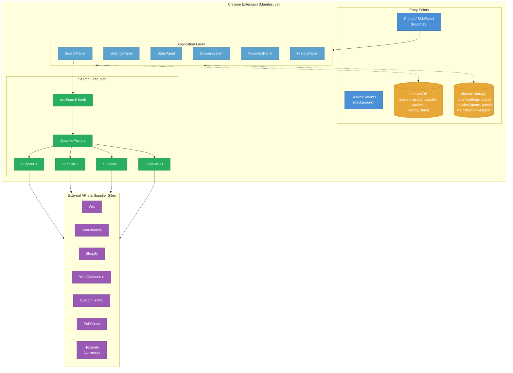

# Architecture Overview

ChemPal is a Chrome Manifest v3 extension that searches multiple chemical supplier websites in parallel and presents results in a unified, filterable table.

## High-Level Architecture

## Key Design Decisions

### Streaming Results
Rather than waiting for all suppliers to finish, `SupplierFactory` uses an `AsyncGenerator` to yield products as they arrive. The UI updates incrementally — users see results within seconds even though some suppliers may take longer.

### Supplier Abstraction
All suppliers extend `SupplierBase`, which defines the lifecycle: `setup()` → `queryProducts()` → `fuzzyFilter()` → `initProductBuilders()` → `getProductData()` → `yield product`. Platform-specific base classes (`SupplierBaseWix`, `SupplierBaseSearchanise`, `SupplierBaseShopify`, `SupplierBaseWoocommerce`, `SupplierBaseMagento2`, `SupplierBaseAmazon`) handle common patterns for those e-commerce platforms.

### Tiered Storage
- **IndexedDB** (`chempal` database) — bulk cached data: search results, supplier query/product caches, search history, supplier stats. Migrated from `chrome.storage` via a one-time migration (`idbMigration.ts`).
- **chrome.storage.local** (via `cstorage`) — lightweight app state: user settings, excluded products, table state, HTTP LRU cache, bookmarks folder ID.
- **chrome.storage.session** (via `cstorage`) — ephemeral session state: current query, panel index, search input text.

### Two-Level Supplier Caching (IndexedDB)
- **Query cache** (`supplierQueryCache` store) — caches search result lists per supplier, keyed by `base64(query + supplier)`
- **Product data cache** (`supplierProductDataCache` store) — caches individual product detail fetches, keyed by `MD5(url + supplier + params)`

Both use LRU eviction at 100 entries via IndexedDB indexes. See [Caching](Caching) for details.

### Optional Storage Compression
`chrome.storage` access flows through `cstorage` (`src/utils/storage.ts`), a thin wrapper that can optionally LZ-compress values at rest using `lz-string`'s `compressToUTF16` inside a versioned envelope (`{ __lz: 1, d: "..." }`). Compression is controlled by the `useStorageCompression` flag in `config.json`. Reads auto-detect the envelope and decompress, while legacy uncompressed values pass through unchanged for backward compatibility. The codec layer is pure (no `chrome.*` access) and directly unit-tested in `src/utils/__tests__/storage.test.ts`. See [Caching § Transparent Compression](Caching#transparent-compression) for details.

> **Note:** IndexedDB data is not compressed via `cstorage`. The compression layer only applies to `chrome.storage` access.

### State Management
The app uses React 19's `useActionState` for settings, with `AppContext` providing global state. The Chrome extension persists query state to `chrome.storage.session` (via `cstorage`) and search results to IndexedDB for seamless restore-on-mount. Theme preference lives in `user_settings` (read through `useAppContext()`), not `localStorage`.

## Chrome Extension Entry Points

| Entry Point | File | Description |
|-------------|------|-------------|
| Popup / Side Panel | `index.html` → `App.tsx` | Main React application |
| Service Worker | `service-worker.js` | Background processing (currently minimal) |
| Manifest | `public/manifest.json` | Extension configuration (Manifest v3) |

## Core Modules

| Module | Path | Role |
|--------|------|------|
| `SupplierBase` | `src/suppliers/SupplierBase.ts` | Abstract base class for all supplier implementations |
| `SupplierFactory` | `src/suppliers/SupplierFactory.ts` | Orchestrates parallel supplier queries via async generator |
| `ProductBuilder` | `src/utils/ProductBuilder.ts` | Builds and validates product objects with a fluent API |
| `SupplierCache` | `src/utils/SupplierCache.ts` | IndexedDB caching layer with LRU eviction |
| `idbCache` | `src/utils/idbCache.ts` | IndexedDB database management (chempal db, v2) |
| `Logger` | `src/utils/Logger.ts` | Structured logging with per-supplier prefixes |
| `Pubchem` | `src/utils/Pubchem.ts` | PubChem compound lookups and suggestions |
| `SupplierStatsStore` | `src/utils/SupplierStatsStore.ts` | Tracks per-supplier success/failure/timing stats |
| `fetchDecorator` | `src/utils/fetchDecorator.ts` | Enhanced fetch wrapper with response capture support |
