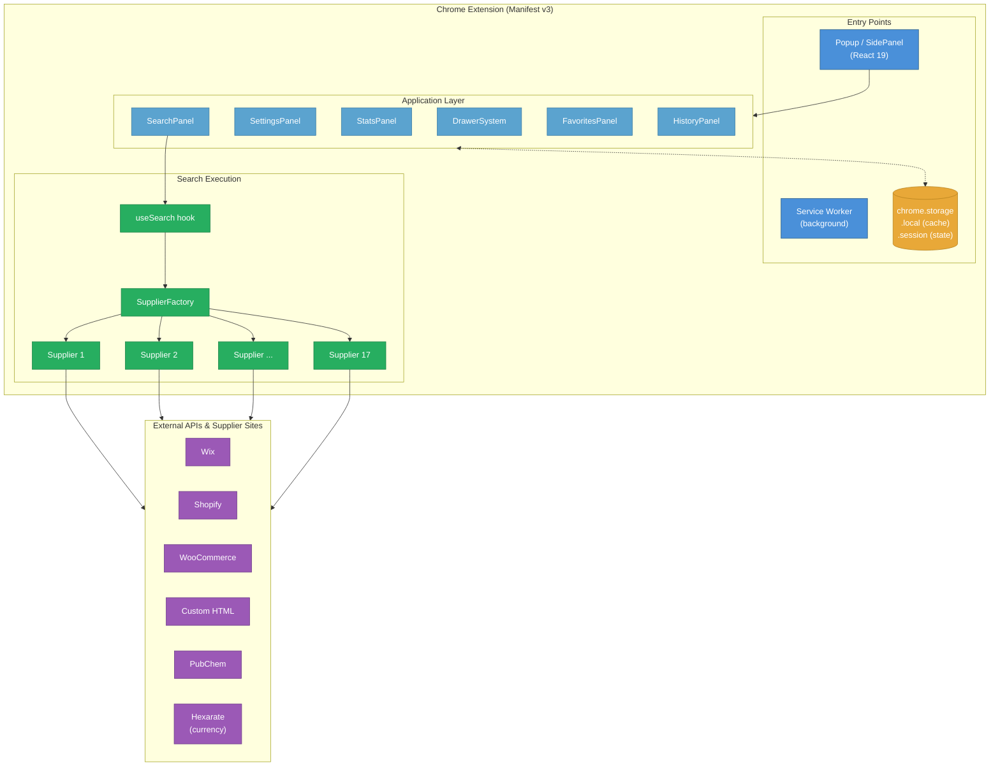

# Architecture Overview

ChemPal is a Chrome Manifest v3 extension that searches multiple chemical supplier websites in parallel and presents results in a unified, filterable table.

## High-Level Architecture

## Key Design Decisions

### Streaming Results
Rather than waiting for all suppliers to finish, `SupplierFactory` uses an `AsyncGenerator` to yield products as they arrive. The UI updates incrementally — users see results within seconds even though some suppliers may take longer.

### Supplier Abstraction
All suppliers extend `SupplierBase`, which defines the lifecycle: `setup()` → `queryProducts()` → `fuzzyFilter()` → `initProductBuilders()` → `getProductData()` → `yield product`. Platform-specific base classes (`SupplierBaseWix`, `SupplierBaseShopify`, `SupplierBaseWoocommerce`) handle common patterns for those e-commerce platforms.

### Two-Level Caching
- **Query cache** (`chrome.storage.local`) — caches search result lists per supplier, keyed by query + supplier name
- **Product data cache** (`chrome.storage.local`) — caches individual product detail fetches, keyed by URL + supplier

Both use LRU eviction at 100 entries. See [Caching](Caching) for details.

### State Management
The app uses React 19's `useActionState` for settings, with `AppContext` providing global state. The Chrome extension persists query state and results to `chrome.storage.session` for seamless restore-on-mount.

## Chrome Extension Entry Points

| Entry Point | File | Description |
|-------------|------|-------------|
| Popup / Side Panel | `index.html` → `App.tsx` | Main React application |
| Service Worker | `service-worker.js` | Background processing (currently minimal) |
| Manifest | `public/manifest.json` | Extension configuration (Manifest v3) |

## Core Modules

| Module | Path | Role |
|--------|------|------|
| `SupplierBase` | `src/suppliers/SupplierBase.ts` | Abstract base class for all supplier implementations |
| `SupplierFactory` | `src/suppliers/SupplierFactory.ts` | Orchestrates parallel supplier queries via async generator |
| `ProductBuilder` | `src/utils/ProductBuilder.ts` | Builds and validates product objects with a fluent API |
| `SupplierCache` | `src/utils/SupplierCache.ts` | Chrome storage caching layer with LRU eviction |
| `Logger` | `src/utils/Logger.ts` | Structured logging with per-supplier prefixes |
| `Pubchem` | `src/utils/Pubchem.ts` | PubChem compound lookups and suggestions |
| `SupplierStatsStore` | `src/utils/SupplierStatsStore.ts` | Tracks per-supplier success/failure/timing stats |
| `fetchDecorator` | `src/utils/fetchDecorator.ts` | Enhanced fetch wrapper with response capture support |
