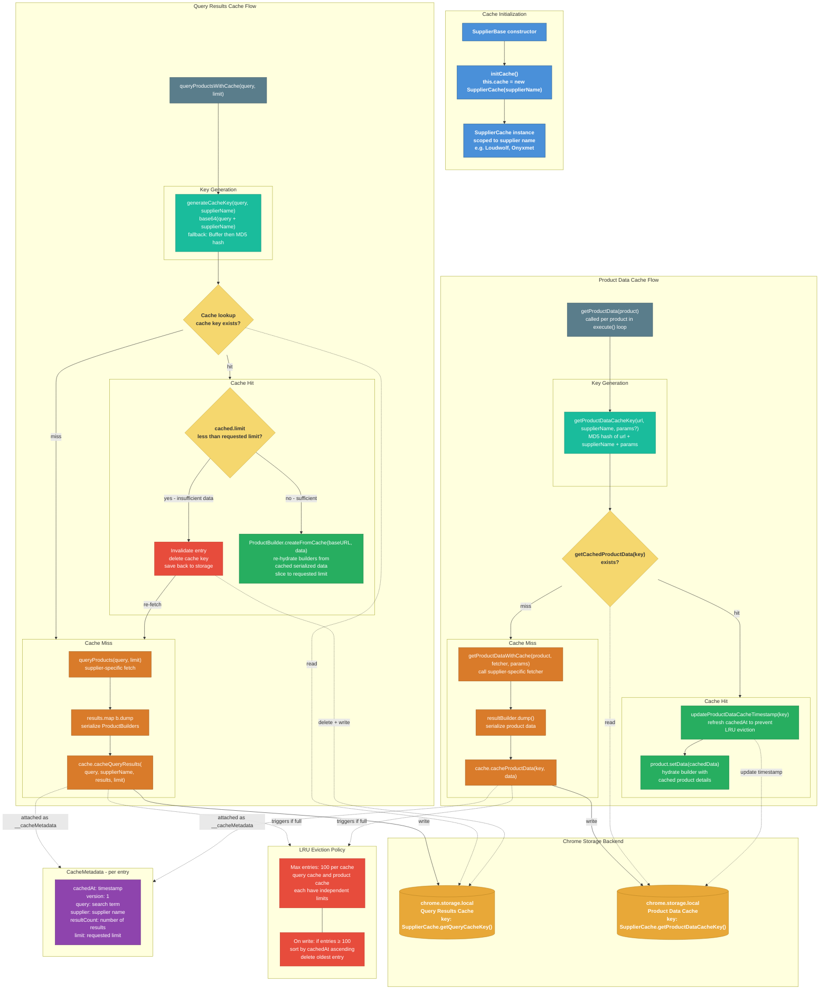

# Caching

ChemPal caches search results and product data in `chrome.storage.local` to avoid redundant network requests across searches.

## Key Concepts

- **Two independent caches**: Query results and product details are cached separately with different key generation strategies
- **LRU eviction**: Both caches cap at 100 entries, evicting the least recently used when full
- **Limit-aware invalidation**: The query cache invalidates entries when a new search requests more results than the cached limit
- **Timestamp refresh on read**: Product data cache updates `cachedAt` on hit to prevent active entries from being evicted
- **Serialization**: `ProductBuilder.dump()` serializes builders for storage; `ProductBuilder.createFromCache()` re-hydrates them

## Cache Architecture

## Query Cache vs Product Data Cache

| | Query Results Cache | Product Data Cache |
|---|---|---|
| **Purpose** | Cache search result lists | Cache individual product details |
| **Key** | `base64(query + supplier)` | `MD5(url + supplier + params)` |
| **Stored data** | Array of serialized `ProductBuilder` snapshots | Single serialized `ProductBuilder` snapshot |
| **Invalidation** | When requested limit exceeds cached limit | LRU eviction only |
| **Written** | After `queryProducts()` returns results | After `getProductData()` fetches a product page |
| **Max entries** | 100 | 100 |
