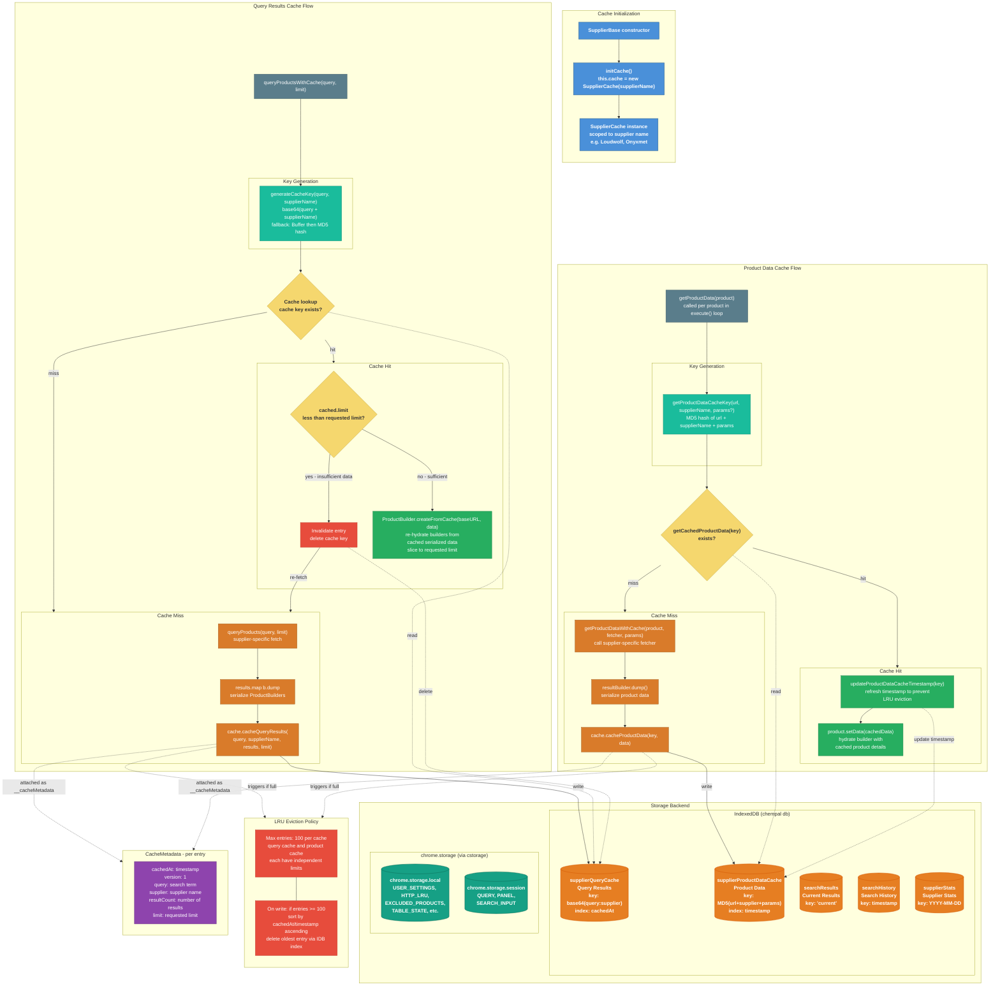

# Caching

ChemPal uses a tiered storage architecture to cache search results, product data, and application state. Bulk cached data (search results, supplier caches, search history, supplier stats) lives in **IndexedDB** for performance and capacity, while lightweight app state (user settings, UI state, excluded products) remains in **chrome.storage**. All `chrome.storage` writes optionally flow through the `cstorage` compression wrapper (see [Transparent Compression](#transparent-compression)).

## Key Concepts

- **IndexedDB for cached data**: Query results, product details, search history, and supplier stats are stored in IndexedDB (`chempal` database, version 2) for better performance with large datasets and no quota pressure on `chrome.storage`
- **chrome.storage for app state**: User settings, table state, excluded products, and session state (current query, panel) remain in `chrome.storage.local` / `chrome.storage.session`
- **Two independent supplier caches**: Query results and product details are cached separately in IndexedDB with different key generation strategies
- **LRU eviction**: Both supplier caches cap at 100 entries, evicting the least recently used when full (using IndexedDB indexes on `cachedAt` / `timestamp`)
- **Limit-aware invalidation**: The query cache invalidates entries when a new search requests more results than the cached limit
- **Timestamp refresh on read**: Product data cache updates `timestamp` on hit to prevent active entries from being evicted
- **Serialization**: `ProductBuilder.dump()` serializes builders for storage; `ProductBuilder.createFromCache()` re-hydrates them
- **Optional compression**: `src/utils/storage.ts` wraps `chrome.storage` with lz-string (UTF-16) compression, controlled by the `useStorageCompression` flag in `config.json`
- **One-time migration**: `idbMigration.ts` migrates legacy `chrome.storage` cache data to IndexedDB on first run

## Storage Architecture

### IndexedDB (`chempal` database, v2)

| Object Store | Key | Purpose | Max Entries | Eviction |
|---|---|---|---|---|
| `searchResults` | `"current"` (single record) | Last search result set | 1 | Overwritten |
| `searchHistory` | `timestamp` | Search history entries | 100 | Oldest pruned on add |
| `supplierQueryCache` | `base64(query:supplier)` | Per-supplier search result lists | 100 | LRU by `cachedAt` index |
| `supplierProductDataCache` | `MD5(url + supplier + params)` | Per-URL product detail snapshots | 100 | LRU by `timestamp` index |
| `supplierStats` | `YYYY-MM-DD` | Per-supplier, per-day statistics | 30 days | Auto-pruned beyond 30 days |

### chrome.storage.local (via `cstorage`)

| Key | Purpose |
|---|---|
| `USER_SETTINGS` | User preferences (theme, currency, suppliers, etc.) |
| `HTTP_LRU` | LRU cache for HTTP responses (100 max entries) |
| `EXCLUDED_PRODUCTS` | Map of user-excluded products |
| `TABLE_STATE` | TanStack table state (sorting, pagination, column visibility) |
| `SELECTED_SUPPLIERS` | Array of selected supplier names |
| `BOOKMARKS_FOLDER_ID` | Chrome bookmarks folder ID for ChemPal favorites |

### chrome.storage.session (via `cstorage`)

| Key | Purpose |
|---|---|
| `QUERY` | Current search query string |
| `SEARCH_INPUT` | Current search input text |
| `SEARCH_IS_NEW_SEARCH` | Boolean flag for new search detection |
| `PANEL` | Current panel index (0=SearchHome, 1=Results, 2=Stats) |

## Transparent Compression

All `chrome.storage` access flows through `cstorage`, a compression-aware facade exported from `src/utils/storage.ts`. Compression is controlled by the `useStorageCompression` flag in `config.json` — when `true`, values are LZ-compressed at rest; when `false`, values are stored as plain JSON.

> **Note:** IndexedDB data is **not** compressed via `cstorage`. The compression layer only applies to `chrome.storage.local` and `chrome.storage.session` access.

### Wire format

When compression is enabled, values are wrapped in a small envelope so reads can distinguish compressed from legacy entries:

```ts
interface LzEnvelope {
  __lz: 1;   // version tag (LZ_VERSION)
  d: string; // lz-string compressToUTF16 output
}
```

On `set`, values are `JSON.stringify`ed and run through `compressToUTF16`, then wrapped in the envelope. On `get`, `isLzEnvelope(value)` decides whether to decompress and `JSON.parse`, or pass the value through unchanged (backward compatibility for data that was written before the wrapper shipped, or written directly via `chrome.storage.*`).

### Two-layer design

The module is intentionally split so the compression logic is directly unit-testable without mocking `chrome.*`:

- **Pure codec** — `encodeValue`, `decodeValue`, `encodeItems`, `decodeItems`, `decodeChanges`, `isLzEnvelope`. No `chrome.*` access.
- **Adapter** — `cstorage.local`, `cstorage.session`, `cstorage.onChanged`. Thin shim that delegates to the codec and talks to `chrome.storage`.

`cstorage.onChanged.addListener` wraps the caller's listener so that `oldValue` / `newValue` in the change payload are already decompressed. A `WeakMap` tracks the outer→inner listener mapping so `removeListener` works as expected.

### Compression toggle

The `useStorageCompression` flag in `config.json` controls whether `encodeValue()` compresses or passes through:

```json
{
  "useStorageCompression": false
}
```

When `false`, `encodeValue()` returns the raw value without wrapping it in an `LzEnvelope`. `decodeValue()` always handles both compressed envelopes and raw values, so toggling the flag is fully backward-compatible with existing data.

### Backward compatibility

- Reads auto-detect envelopes, so pre-compression data in users' browsers continues to work after upgrade.
- Reads of externally-written envelopes (e.g. another page that imports `cstorage`) are transparent.
- If compression or decompression fails, the wrapper logs via `Logger("storage")` and falls back to the raw value so cached data is never lost on a codec error.
- The envelope carries a `__lz` version tag (`LZ_VERSION = 1`) so the wire format can be migrated in the future.

## One-Time Migration

`idbMigration.ts` runs once before React renders (called from `main.tsx`). It migrates legacy `chrome.storage` cache data to IndexedDB:

| Legacy Key (chrome.storage) | Target (IndexedDB store) |
|---|---|
| `search_results` (session) | `searchResults` |
| `search_history` (local) | `searchHistory` |
| `supplier_query_cache` (local) | `supplierQueryCache` |
| `supplier_product_data_cache` (local) | `supplierProductDataCache` |
| `supplier_stats_*` and legacy `supplierStats` (local) | `supplierStats` (with date key conversion) |

The migration is idempotent — it checks the `__idb_migrated` flag in `chrome.storage.local` and skips if already run. After migration, legacy cache keys are removed from `chrome.storage`. Non-cache keys (`USER_SETTINGS`, `HTTP_LRU`, `EXCLUDED_PRODUCTS`, etc.) are not touched.

## Cache Architecture



## Query Cache vs Product Data Cache

| | Query Results Cache | Product Data Cache |
|---|---|---|
| **Storage** | IndexedDB `supplierQueryCache` | IndexedDB `supplierProductDataCache` |
| **Purpose** | Cache search result lists | Cache individual product details |
| **Key** | `base64(query + supplier)` | `MD5(url + supplier + params)` |
| **Stored data** | Array of serialized `ProductBuilder` snapshots | Single serialized `ProductBuilder` snapshot |
| **Invalidation** | When requested limit exceeds cached limit | LRU eviction only |
| **Written** | After `queryProducts()` returns results | After `getProductData()` fetches a product page |
| **Max entries** | 100 | 100 |
| **LRU index** | `cachedAt` | `timestamp` |
