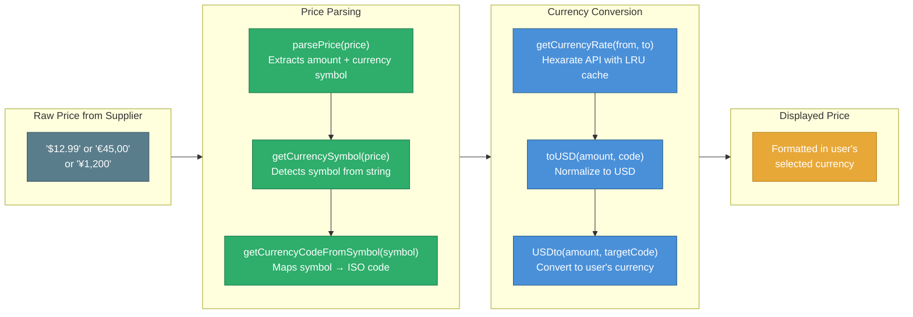

# Currency & Pricing

ChemPal supports multi-currency display with automatic exchange rate conversion, allowing users to compare prices across international suppliers in their preferred currency.

## How It Works

## Supported Currencies

| Code | Symbol | Location |
|------|--------|----------|
| USD | `$` | United States |
| CAD | `CA$` | Canada |
| GBP | `£` | United Kingdom |
| AUD | `AU$` | Australia |
| CNY | `¥` | China |
| INR | `₹` | India |
| RUB | `₽` | Russia |
| EUR | `€` | Finland, Germany |

## Key Functions

Located in `src/helpers/currency.ts`:

| Function | Description |
|----------|-------------|
| `parsePrice(price)` | Full price parsing — extracts numeric amount and detects currency |
| `getCurrencySymbol(price)` | Extracts the currency symbol from a price string |
| `getCurrencyRate(from, to)` | Fetches the exchange rate between two currencies (LRU cached, max 5 entries) |
| `toUSD(amount, currencyCode)` | Converts an amount to USD |
| `USDto(amount, currencyCode)` | Converts a USD amount to the target currency |
| `getCurrencyCodeFromSymbol(symbol)` | Maps a currency symbol to its ISO code |
| `getCurrencyCodeFromLocation(location)` | Maps a location code to the local currency |

## Exchange Rate Source

Rates are fetched from the [Hexarate API](https://hexarate.paikama.co) and cached using an in-memory LRU cache (max 5 entries) to avoid redundant API calls during a single session.

## Price Parsing

ChemPal uses the `price-parser` library (v3.4.0) for robust price extraction from varied supplier formats, supplemented by custom logic for currency symbol detection and normalization.
