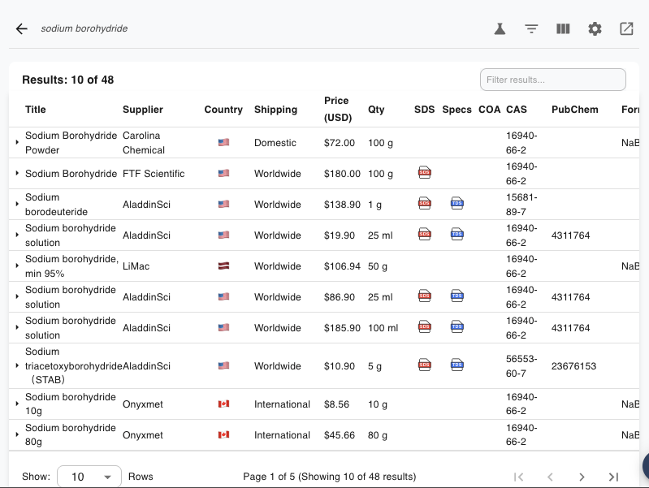

## ChemPal User Guide

**ChemPal** is a free, open-source browser extension (Chrome & Firefox) that helps
amateur chemistry hobbyists find the best deals on chemical reagents. Search **27
chemical suppliers at once** from a single bar and compare prices, quantities, and
purity side-by-side in one sortable table — with prices converted to your currency
and quantities normalized so the comparison is fair.

Unlike the tools built for universities and research institutions, ChemPal only
searches suppliers that **sell to individuals and ship to residences**.

## What it does

- 🔎 **One search, every supplier** — query 27 vendors at once; results stream in
  live as each supplier responds.
- 🧪 **Search however you think** — by chemical name, CAS number, chemical formula,
  or SMILES string.
- 🧮 **Boolean / advanced search** — combine terms with `AND` / `OR` / `NOT` and
  quoted phrases, e.g. `(sodium OR potassium) AND hydroxide`.
- 💲 **Fair price comparison** — every price converted to your chosen currency and
  every quantity normalized to a common unit.
- 📈 **Price tracking** — ChemPal remembers each product's price over time so you
  can see whether it's rising or falling.
- 🚚 **Ship-to-you filtering** — restrict results to suppliers that ship to your
  country.
- 📄 **One-click documents** — jump straight to a product's SDS, TDS, and COA when
  the supplier provides them.
- 🖱️ **Right-click search** — highlight any text on any web page and search it in
  ChemPal.
- 🔒 **Private by design** — no account, no sign-up, and no data collection by the
  developer. See [Privacy](Privacy).

## Start here

| Page | What you'll find |
|------|------------------|
| [Installation](Installation) | Install ChemPal in Chrome or Firefox, and how to open it |
| [Searching](Searching) | Run your first search from the home search bar |
| [Search Types](Search-Types) | Search by name, CAS, formula, or SMILES |
| [Advanced (Boolean) Search](Advanced-Search) | Combine terms with `AND` / `OR` / `NOT` |
| [Search Filters](Search-Filters) | Narrow a search with the side panel |
| [Right-Click Search](Right-Click-Search) | Search selected text from any web page |
| [The Results Table](Results-Table) | Columns, sorting, filtering, and product details |
| [Prices & Currency](Prices-and-Currency) | How prices are converted and compared |
| [Price Tracking](Price-Tracking) | See how a product's price changes over time |
| [Search History](Search-History) | Revisit and re-run past searches |
| [Supported Suppliers](Supported-Suppliers) | The full list of suppliers ChemPal searches |
| [Settings](Settings) | Every setting, explained |
| [Caching](Caching) | Why repeat searches are faster, and how to clear the cache |
| [Privacy](Privacy) | What stays on your device |
| [FAQ & Troubleshooting](FAQ-and-Troubleshooting) | Common questions and fixes |
| [Contributing & Development](Contributing-and-Development) | For developers |

> **Heads up:** ChemPal helps you *find and compare* products. Always read each
> supplier's own listing, safety data sheet, and terms before buying. Prices and
> availability shown in ChemPal come straight from the suppliers and can change at
> any time.
