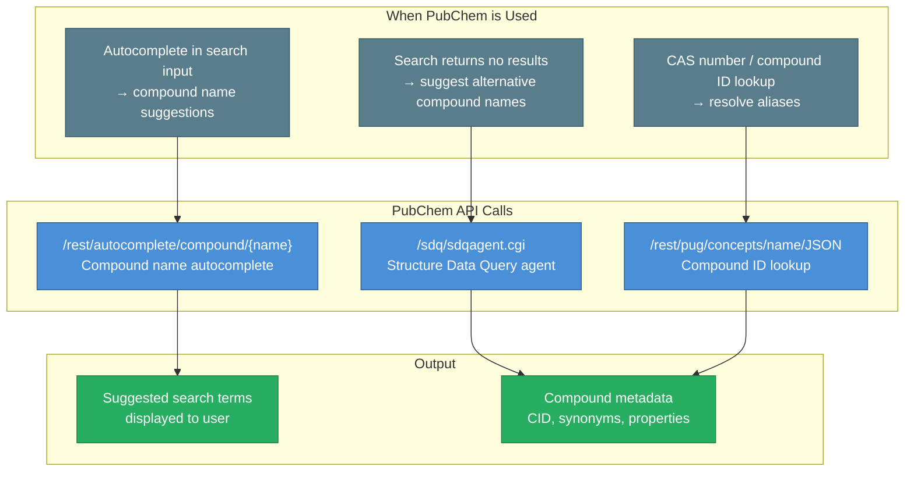

# PubChem Integration

ChemPal integrates with the [PubChem API](https://pubchem.ncbi.nlm.nih.gov/) for compound lookups, search suggestions, and chemical name resolution.

## Use Cases

## API Methods

Located in `src/utils/Pubchem.ts`:

| Method | API Endpoint | Description |
|--------|-------------|-------------|
| `getCompound(name)` | `/rest/autocomplete/compound/{name}` | Autocomplete lookup for compound names |
| `getCID(name)` | `/rest/pug/concepts/name/JSON?name={name}` | Get the PubChem Compound ID (CID) |
| `querySdqAgent(query)` | `/sdq/sdqagent.cgi` | Query the SDQ agent for compound data |
| `getSimpleName(name)` | Derived from above | Get the simplified/common compound name |
| `getCompoundNameFromAlias(synonym)` | Derived from above | Resolve a synonym to its canonical name |

## SDQ Query Types

The SDQ (Structure Data Query) agent supports querying across multiple PubChem collections:

- `compound` — Chemical compounds
- `substance` — Substance records
- `pubmed` — Related publications
- `patent` — Patent references

## Type Definitions

Located in `src/types/pubchem.d.ts`:

| Type | Description |
|------|-------------|
| `SDQCollection` | Union of queryable collection types |
| `SDQResponse` | Full response envelope from SDQ agent |
| `SDQOutputSet` | Individual output set containing compound information |
| `SDQResultItem` | Individual compound data row (100+ properties) |
| `SDQAgentQuery` | Query parameters for the SDQ agent |
| `SDQQuery` | Query parameters for SDQ lookups |
| `CompoundResponse` | Autocomplete response structure |
| `CIDResponse` | Compound ID lookup response structure |

## Helper Functions

Located in `src/helpers/pubchem.ts`, these provide type guards and assertion functions for validating PubChem API responses:

- `assertIsSDQResponse(data)` — Asserts data is a valid `SDQResponse`
- `assertIsSDQWhere(where)` — Asserts data is a valid `SDQWhere`
- `assertIsCIDResponse(data)` — Asserts data is a valid `CIDResponse`
- `assertIsCompoundResponseResponse(data)` — Asserts data is a valid `CompoundResponse`
- `assertIsSdqAgentResponse(data)` — Asserts data is a valid SDQ agent response
