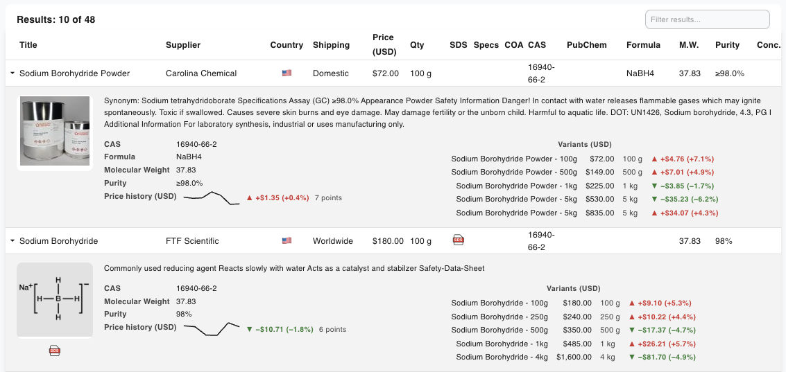
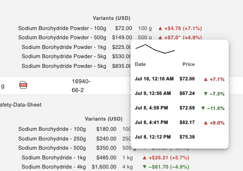
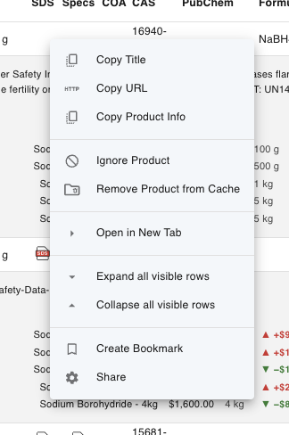

Every search lands here. The results table shows one row per product, gathered
from all your suppliers, and gives you the tools to sort, filter, and dig into each
one.

At the top you'll see a count like **"Results: 10 of 48"** — the number currently
shown versus the total found.

## The columns

ChemPal automatically **hides columns that have no data** for the current search
(you can turn this off — see below), so you may not see every column every time.
The full set is:

| Column | What it shows |
|--------|---------------|
| **▸** (first column) | An expander arrow — click it to open the [product details](#product-details) for that row. |
| **Title** | The product name, linking to the supplier's listing. |
| **Supplier** | Which supplier the result came from. |
| **Country** | The supplier's country (shown as a flag; hover for the name). |
| **Shipping** | Worldwide, International, Domestic, or Local. |
| **Availability** | In Stock, Limited, Out of Stock, Pre-order, etc. (hidden by default). |
| **Description** | A short product description, when available. |
| **Price (USD)** | The price, converted to your currency. The header shows your chosen currency code. See [Prices & Currency](Prices-and-Currency). |
| **Qty** | The amount, e.g. "500 g". |
| **Unit** | The unit price where available. |
| **SDS** | Link to the Safety Data Sheet, when the supplier provides one. |
| **Specs** | Link to the Technical Data Sheet (TDS). |
| **COA** | Link to the Certificate of Analysis. |
| **CAS** | The CAS number, linking to PubChem. |
| **PubChem** | The PubChem Compound ID (CID), linking to its PubChem page. |
| **Formula** | The chemical formula. |
| **M.W.** | Molecular weight. |
| **Purity** | Purity percentage or grade (e.g. "ACS"). |
| **Conc.** | Concentration, for solutions. |

## Sorting

Click any column header to sort by it; click again to reverse the order. A small
arrow in the header shows the current sort direction. For example, click **Price
(USD)** to line products up cheapest-first. (The expander and document columns —
SDS, Specs, COA — aren't sortable.)

## Filtering: two kinds

There are two independent ways to narrow what's on screen. Both hide rows; neither
changes what was searched.

### Global filter

The **"Filter results…"** box above the table filters across **all columns at
once**. Type "worldwide" and you'll see only rows matching that anywhere. When a
filter is active, the count reads **"Results: N of M"**.

### Per-column filters

Click the **funnel icon** in the toolbar to reveal a row of filter inputs *beneath
each column header*. Now you can filter each column on its own — a price range
under **Price**, a supplier name under **Supplier**, and so on. The funnel icon
turns blue while the filter row is showing. A **clear-all-filters** button appears
at the left of that row to reset them.

## Showing and hiding columns

Click the **columns icon** in the toolbar to open a checklist of every column.
Tick or untick a column to show or hide it. This is handy for focusing on just the
fields you care about (say, Title, Supplier, Price, and Qty).

By default, ChemPal also **auto-hides empty columns** so the table stays tidy. To
always see every column, turn off **Settings → Display → "Auto hide empty
columns"**.

## The toolbar

Along the top of the results view:

| Icon | Action |
|------|--------|
| **← Back** | Return to the search home. |
| 🧪 **Flask** | Open the [Search Filters](Search-Filters) side panel. |
| **Funnel** | Toggle the per-column filter row. |
| **Columns** | Show or hide individual columns. |
| ⚙️ **Gear** | Open [Settings](Settings). |
| **⧉ Open-in-tab** | Open ChemPal in a full browser tab. |

## Pagination

When there are more than 10 results, controls appear at the bottom:

- **Show [N] Rows** — choose how many rows per page (with an **All** option to show
  everything on one page).
- **Page X of Y** with first / previous / next / last buttons to move between pages.

## Product details

Click the **▸ arrow** at the start of a row to expand it. The detail panel shows
everything ChemPal gathered about that product:

- A **product image** (or a carousel, if there are several) with the **SDS / TDS /
  COA** document links beside it.
- **Chemical details** — CAS, formula, molecular weight, IUPAC name, InChI /
  InChIKey, SMILES, purity, grade, concentration, manufacturer, and a PubChem link
  (only fields that have data are shown).
- **Variants** — if the product comes in multiple sizes, each is listed with its
  own price and quantity so you can compare them directly.
- **Price history** — a small trend sparkline showing how the price has moved over
  time. See [Price Tracking](Price-Tracking).

Variant price trend history available on hover

## Right-click a row

Right-clicking a result row opens a menu with quick actions:

- **Copy Title**, **Copy URL**, **Copy Product Info**
- **Open in New Tab** — open the supplier's listing
- **Create Bookmark** / **Share**
- **Expand all** / **Collapse all** visible rows
- **Ignore Product** — hide this exact product from future searches (see below)
- **Remove Product from Cache** — forget ChemPal's saved copy so it's re-fetched
  fresh next time (see [Caching](Caching))

### Ignored (excluded) products

**Ignore Product** adds an item to your **Excluded Products** list so it won't
clutter future results. You can review and restore ignored products anytime in
**Settings → Excluded Products**.

---

**Next:** [Prices & Currency →](Prices-and-Currency) · [Price Tracking →](Price-Tracking)
