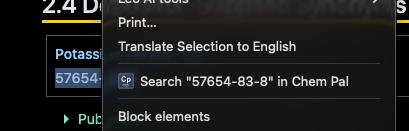

You don't have to open ChemPal to start a search. Come across a chemical name, CAS
number, or formula on **any web page** — a forum post, a Wikipedia article, a
supplier's own site — and you can search it in one step.

## How to use it

1. **Highlight** the text you want to search on any web page.
2. **Right-click** the selection.
3. Choose **Search "…" in Chem Pal** from the menu (the `…` is replaced with the
   text you highlighted).

ChemPal opens in a **full browser tab** and runs the search automatically — you'll
see results without typing anything.

## Good to know

- The menu item **only appears when text is selected.** A plain right-click on an
  empty part of the page won't show it.
- Right-click search always opens ChemPal in a **full tab** (not the popup or side
  panel). If a ChemPal tab is already open, it's reused and brought to the front.
- It works exactly like typing the same text into the search bar, so all the
  usual [search types](Search-Types) apply — highlight a CAS number and it searches
  by CAS, highlight a name and it searches by name.

---

**Next:** [The Results Table →](Results-Table)
