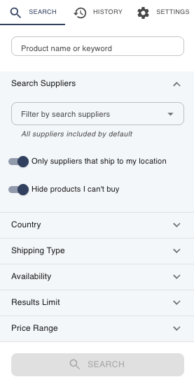

# Search Filters (Side Panel)

The **home search bar** is great for quick lookups. When you want to be more
deliberate — search only certain suppliers, only vendors that ship to you, or
only products in a price range — open the **side panel**.

Click the **🧪 flask / beaker icon** in the search bar (its label is **"advanced
options"**) to open the panel on the **Search** tab.

## Home bar vs. side panel

| | Home search bar | Side panel (Search tab) |
|---|---|---|
| **Best for** | Quick, free-text searches | Narrowing a search with specific constraints |
| **Boolean logic** | Yes — `AND` / `OR` / `NOT` typed inline ([Advanced Search](Advanced-Search)) | Uses the term you enter, plus structured filters |
| **Filters** | None (searches all enabled suppliers) | Suppliers, country, shipping, availability, price, result limit |

They work together: the panel's **Product name or keyword** field is the same
query as the home bar.

## What you can filter

The Search tab is a set of collapsible sections:

| Filter | What it does |
|--------|--------------|
| **Product name or keyword** | Your search term (shared with the home bar). |
| **Search Suppliers** | Limit the search to specific suppliers. *All suppliers are included by default.* |
| **Country** | Limit to suppliers based in specific countries. *All countries included by default.* |
| **Shipping Type** | Filter by how a supplier ships — Worldwide, International, Domestic, or Local. |
| **Availability** | Filter by stock status (In Stock, Limited, Out of Stock, etc.). |
| **Results Limit** | How many results to request **per supplier**. Higher = more results but slower searches. |
| **Price Range** | Set a minimum and/or maximum price. |
| **Only suppliers that ship to my location** | Excludes any supplier that won't ship to the country set in your [Settings](Settings). |

When you've set your filters, click the **Search** button at the bottom of the
panel to run it.

## "Only suppliers that ship to my location"

This is the quickest way to hide products you can't actually buy. It uses the
**Location** you set in [Settings](Settings) and drops any supplier that doesn't
ship there. If it happens to exclude *every* supplier, ChemPal tells you:

> "No suppliers ship to your location. Turn off 'Only suppliers that ship to my
> location' in the search drawer to include them."

See [Supported Suppliers](Supported-Suppliers) for how each supplier's shipping is
determined.

---

**Next:** [Right-Click Search →](Right-Click-Search) · [The Results Table →](Results-Table)
