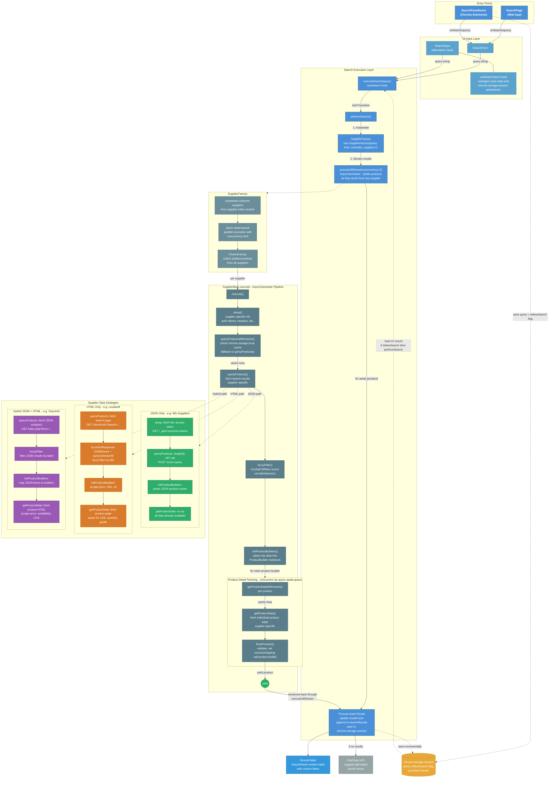

# Search Flow

This page details the end-to-end search flow from user input through to rendered results, including how the search execution layer orchestrates multiple suppliers in parallel via streaming.

## Key Concepts

- **Two entry points**: `SearchPage` (web app) and `SearchPanelHome` (Chrome extension) both feed into the same execution pipeline
- **Streaming results**: `SupplierFactory.executeAllStream()` yields products as they arrive from any supplier, enabling incremental UI updates
- **Session persistence**: The Chrome extension persists query state and results to `chrome.storage.session` for restore-on-mount
- **Supplier data strategies**: Each supplier implements one of three patterns depending on what the vendor's site exposes:
  - **JSON Only** (e.g. Wix) — GraphQL/REST API provides all product data in the search response; no detail page fetch needed
  - **HTML Only** (e.g. Loudwolf) — Both search results and product details are scraped from HTML pages via `DOMParser`
  - **Hybrid** (e.g. Onyxmet) — Search results come from a JSON endpoint, but product details require scraping the HTML product page

## Diagram

