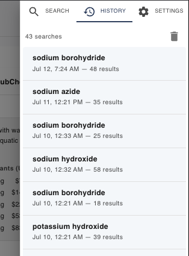

ChemPal keeps a list of your past searches so you can jump back to one without
retyping it — including all the filters and suppliers you had set at the time.

## Finding your history

Open the side panel and switch to the **History** tab. (The panel opens from the
🧪 flask icon in the search bar; then choose **History**.)

Each entry shows:

- The **search query** (click it to run it again).
- **When** you searched and **how many results** it returned.
- A **filter icon** if the search used filters — hover it to see a summary
  (availability, country, shipping, or the number of suppliers selected).

## Re-running a search

Click any query in the list. ChemPal **restores the exact search** — the same term,
the same [filters](Search-Filters), and the same supplier selection — then takes
you straight to the results. It's the quickest way to repeat a comparison you did
before (and, combined with [price tracking](Price-Tracking), to watch how prices
have shifted since).

## Clearing your history

Click the **trash icon** in the History tab header (**"Clear search history"**) to
remove all entries at once. Your search history is stored only **on your device**
— see [Privacy](Privacy).

---

**Next:** [Supported Suppliers →](Supported-Suppliers)
