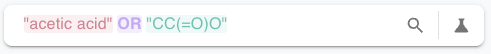
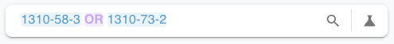

You can search ChemPal however you naturally think about a chemical. All of these
go into the **same search bar** — there's no "search by" dropdown to set first.

| You can search by | Example | Notes |
|-------------------|---------|-------|
| **Chemical name** | `sodium hydroxide`, `acetone` | The most common way to search. |
| **CAS number** | `7647-14-5` | The registry number for a substance. Often the most precise search. |
| **Chemical formula** | `NaOH`, `KMnO4` | Validated against real element symbols. |
| **SMILES string** | `O=C=O`, `c1ccccc1` | A structural notation for a molecule. |

## How ChemPal reads your query

As you type, ChemPal quietly recognizes what *kind* of term you've entered and
**tints it with a color** so you can see it understood you:

- **Chemical name / plain text** — normal text color
- **CAS number** — blue
- **Chemical formula** — lavender
- **SMILES** — teal

This coloring is a **visual hint only** — it doesn't change what gets searched.
ChemPal sends your text to the suppliers as-is; the color just confirms how it
interpreted the term (which is especially handy inside an
[advanced query](Advanced-Search)).

## Tips for better results

- **Names vary between suppliers.** One vendor lists "lye", another "sodium
  hydroxide", another "caustic soda". If a name search is thin, try the **CAS
  number** — it's the same everywhere.
- **Formulas can be ambiguous.** `CCO` reads as a valid formula, but it's also the
  SMILES for ethanol. When in doubt, search by name or CAS.
- **Let ChemPal help.** When a search finds nothing, it may offer a suggestion
  pulled from PubChem, such as **"Try searching by CAS number instead: …"** or
  **"Perhaps try searching for: …"**. Click it to re-run with the suggested term.

---

**Next:** [Advanced (Boolean) Search →](Advanced-Search)
