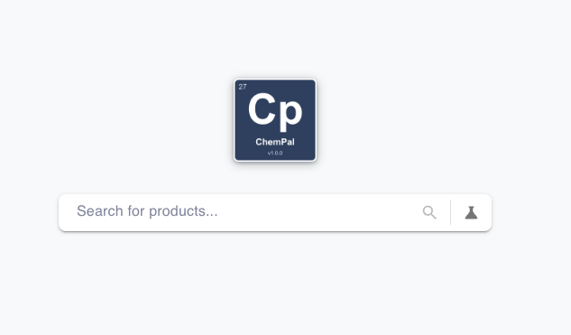
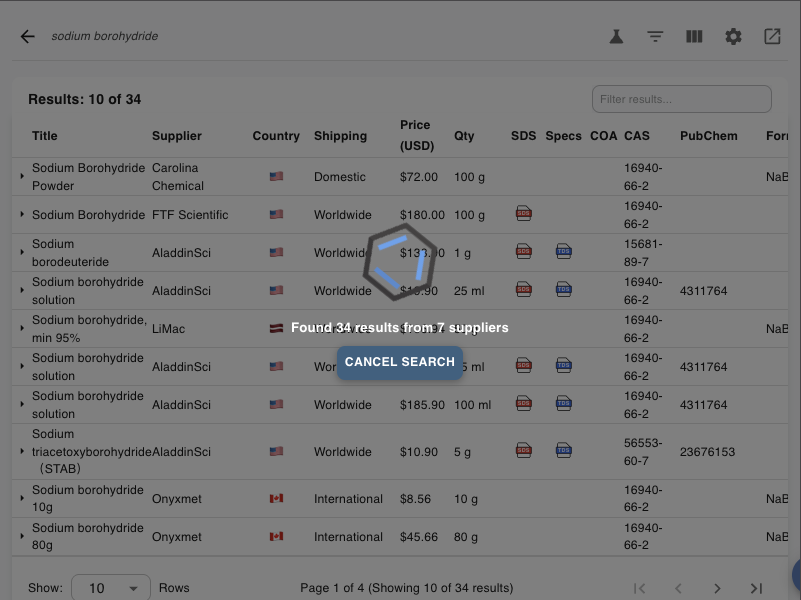

# Searching

The fastest way to use ChemPal is the **home search bar**. Type what you're
looking for, press search, and results stream in from every enabled supplier.

## The home search bar

When you open ChemPal you land on the search home. In the middle is a single
search bar with the placeholder **"Search for products…"**.

Around it you'll find:

| Control | What it does |
|---------|--------------|
| 🔍 **Magnifying glass** (in the bar) | Runs the search. It stays disabled until you've typed a valid query. |
| 🧪 **Flask / beaker** (in the bar) | Opens **advanced options** — the side panel where you can filter by supplier, country, shipping, price, and more. See [Search Filters](Search-Filters). |
| ⚙️ **Gear** (top-right) | Opens [Settings](Settings). |
| **➜ badge** (top-right) | Appears when you have results from a previous search — click it to jump back to them. The number is the result count. |
| **⧉ Open-in-tab** (top-right) | Pops ChemPal out into a full browser tab. |

## Running a search

1. Type your query — a chemical name, CAS number, formula, or SMILES string.
   See [Search Types](Search-Types) for what each looks like.
2. Press **Enter** or click the 🔍 magnifying glass.
3. ChemPal contacts every enabled supplier at once. Results appear **as they
   arrive** — you don't have to wait for the slowest supplier to finish.

While a search runs, a progress overlay shows how many results have come in so
far (e.g. **"Found 34 results from 7 suppliers"**) along with a **Cancel Search**
button if you want to stop early and keep what's already loaded.

When the search finishes, the [Results Table](Results-Table) shows everything
found, ready to sort and filter.

## Two ways to search: the bar vs. the side panel

ChemPal gives you two complementary tools:

- **The home search bar** — quick, free-text searching. It also understands
  **[boolean / advanced syntax](Advanced-Search)** (`AND` / `OR` / `NOT`,
  parentheses, quoted phrases) typed directly into the bar.
- **The side panel (flask icon)** — a form for building a more **structured**
  search: pick specific suppliers, limit to certain countries or shipping types,
  set a price range, and more. See [Search Filters](Search-Filters).

You can use either on its own, or combine them.

## No results?

If a search comes back empty, ChemPal may suggest an alternative — for example
**"Try searching by CAS number instead: …"** — using data from PubChem. Clicking
the suggestion re-runs the search with that term. See [Search Types](Search-Types)
for more on why one form of a query can find products another misses.

---

**Next:** [Search Types →](Search-Types) · [Advanced Search →](Advanced-Search)
