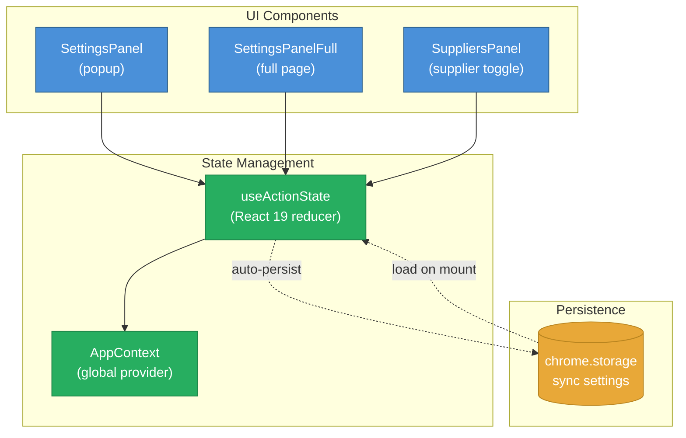

# Settings & Configuration

## User Settings

User settings are managed via React 19's `useActionState` and persisted to Chrome storage. The settings UI is available through the drawer navigation.

### Available Settings

| Setting | Type | Description |
|---------|------|-------------|
| `caching` | `boolean` | Enable/disable supplier result caching |
| `autocomplete` | `boolean` | Enable search input autocomplete suggestions |
| `currency` | `CurrencyCode` | Preferred currency for price display |
| `location` | `CountryCode` | User's geographic location |
| `shipsToMyLocation` | `boolean` | Filter results to suppliers that ship to your location |
| `suppliers` | `string[]` | List of enabled supplier class names |
| `theme` | `string` | UI theme selection |
| `showHelp` | `boolean` | Show help tooltips |
| `showColumnFilters` | `boolean` | Show column filter inputs in results table |
| `columnFilterConfig` | `object` | Per-column filter configuration |
| `hideColumns` | `string[]` | Columns hidden from the results table |
| `supplierResultLimit` | `number` | Maximum results per supplier |

### Setting Actions

Settings changes are dispatched as actions through a reducer:

| Action | Trigger |
|--------|---------|
| `SWITCH_CHANGE` | Toggle switches (caching, autocomplete, etc.) |
| `INPUT_CHANGE` | Text/select inputs (currency, location, etc.) |
| `BUTTON_CLICK` | Button actions (e.g. clear cache) |
| `RESTORE_DEFAULTS` | Reset all settings to defaults |

## State Architecture

## Supported Locations

Configured in `config.json`:

| Code | Country | Default Currency |
|------|---------|-----------------|
| US | United States | USD |
| CA | Canada | CAD |
| UK | United Kingdom | GBP |
| AU | Australia | AUD |
| NZ | New Zealand | NZD |
| JP | Japan | JPY |
| CN | China | CNY |
| IN | India | INR |
| RU | Russia | RUB |
| FIN | Finland | EUR |
| DE | Germany | EUR |
| OTHER | Other | USD |

## Supplier Selection

Users can enable/disable individual suppliers through the Suppliers panel. Only enabled suppliers are queried during search. The selection is passed to `SupplierFactory` which filters accordingly.
