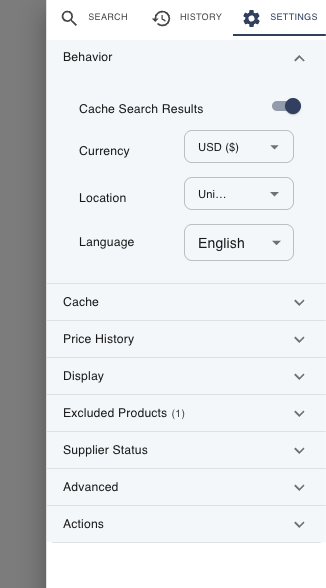

Open settings with the **⚙️ gear icon** (top-right of the search bar, or in the
results toolbar). Settings open in the side panel, organized into collapsible
sections. Below is every section and what each control does.

## Behavior

| Setting | What it does |
|---------|--------------|
| **Cache Search Results** | Master switch for [caching](Caching). On by default — leave it on for faster repeat searches. |
| **Currency** | The currency all prices are shown in. Selecting a non-USD currency reveals the current conversion rate (e.g. "1 USD = 0.92 EUR"). See [Prices & Currency](Prices-and-Currency). |
| **Location** | Your country. Drives the **"ship to my location"** filter and shipping display. |
| **Language** | The extension's display language. |

## Cache

| Setting | What it does |
|---------|--------------|
| **Do Not Cache Empty Results** | When on, a supplier that returns nothing won't be cached as empty — so it can surface fresh results next time. |
| **Cache TTL (minutes)** | How long a cached search result stays valid. `0` (the default) means entries don't expire on a timer. |
| **Clear cache** | Empties the search + product caches now. Your [price history](Price-Tracking) is **not** affected. |

A caption here also shows how much cached data you currently have.

## Price History

| Setting | What it does |
|---------|--------------|
| **Track price history** | Records each product's price over time. **On by default.** See [Price Tracking](Price-Tracking). |
| **Max price points per product** | Caps how many data points to keep per product (`0` = unlimited). |
| **Clear price history** | Erases all recorded price history. Separate from **Clear cache**. |

## Display

| Setting | What it does |
|---------|--------------|
| **Font Size** | Choose Small, Medium, or Large. |
| **Open in a tab** | When on, clicking the toolbar icon opens ChemPal in a full browser tab instead of the popup. |
| **Auto hide empty columns** | Automatically hides [results columns](Results-Table) that have no data for the current search. On by default. |

## Excluded Products

The products you've chosen to **Ignore** (via [right-click on a result](Results-Table#right-click-a-row)).
Each is listed with a link back to the supplier and a delete button to un-ignore
it. **Clear All** empties the list. When empty, it reads *"No excluded products."*

## Supplier Status

A switch for each of the 27 [supported suppliers](Supported-Suppliers). Turning one
off removes it from **all** searches and from the supplier filters. Use this to
permanently exclude suppliers you never want to see.

## Advanced

| Setting | What it does |
|---------|--------------|
| **Fuzz match method** | How closely a product title must match your query to be kept. "Default (per supplier)" is recommended; other options change the matching algorithm. |
| **Max search time (ms)** | Caps how long each supplier gets before ChemPal stops waiting and shows what it has. Empty = each supplier's own default; `0` = no limit. |
| **Disable fuzzy filtering** | Shows raw results without relevance ranking — every plain match, or (in [advanced search](Advanced-Search)) every result satisfying your boolean logic. |

## Actions

- **Restore Defaults** — resets settings to their original values (caching on,
  price tracking on, medium font, all suppliers enabled, default columns, etc.).

## Where's the theme (light/dark) toggle?

Light/dark theme isn't in this panel — it's on the floating **speed-dial menu**
(the round button in the corner of the ChemPal window), via **Toggle Theme**.

---

**Next:** [Caching →](Caching)
