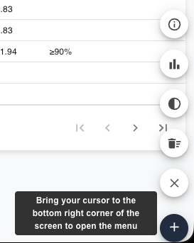
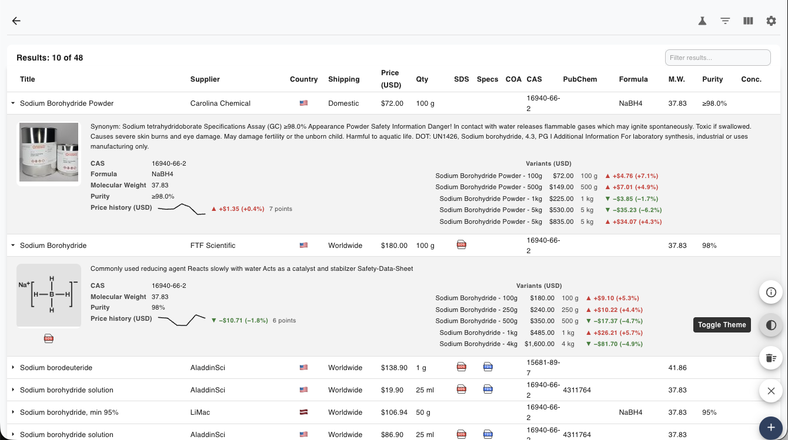
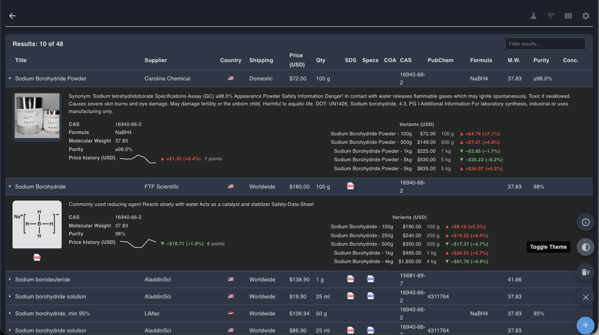
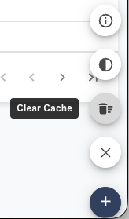
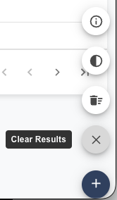

The **Speed Dial** is a floating button tucked into the bottom-right corner of the
ChemPal window. It gives you one-tap access to a few common actions — clearing
results, clearing the cache, switching themes, and viewing app info — without
opening [Settings](Settings).

## Opening the Speed Dial

The Speed Dial stays out of the way until you need it. **Move your cursor to the
bottom-right corner of the window** and it slides into view; move away and it
tucks itself back out of sight. Hover (or tap) the **+** button to fan out the
actions.

## Actions

From the top of the stack down:

| Action | What it does |
|--------|--------------|
| **About** | Opens the About dialog with version and project info. |
| **Toggle Theme** | Switches between light and dark mode. |
| **Clear Cache** | Empties all cached supplier results — see [Caching](Caching). |
| **Clear Results** | Clears the results currently on screen. |

### Toggle Theme

Flip between light and dark mode without leaving the current view. The same
setting lives in [Settings](Settings), but this is the quickest way to switch.

### Clear Cache

Wipes every cached supplier response so your next search fetches fresh prices and
listings. Useful when you suspect a supplier's data has changed. See
[Caching](Caching) for how the cache works.

### Clear Results

Removes the results currently shown in the table without touching your cache or
search history — handy for starting a fresh comparison.

> **Note:** development builds show an extra **Stats** button (a bar-chart icon).
> It isn't present in the Chrome Web Store release.

Prefer the keyboard? Many of these actions have shortcuts too — see
[Keyboard Shortcuts](Keyboard-Shortcuts).

---

**Next:** [Keyboard Shortcuts →](Keyboard-Shortcuts)
