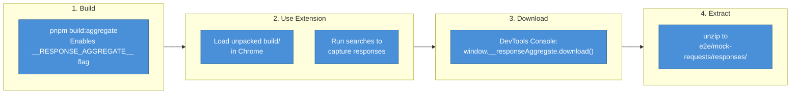

# Testing

ChemPal uses Vitest for both unit and E2E testing, with Mock Service Worker (MSW) for API mocking and Playwright for browser-based E2E tests.

## Test Configuration

| Config | File | Environment | Purpose |
|--------|------|-------------|---------|
| Unit tests | `vitest.config.ts` | jsdom | Component and utility tests |
| E2E tests | `vitest.e2e.config.ts` | node | Full browser tests via Playwright |

### Unit Test Settings
- **Pool**: vmThreads (max 4, min 1)
- **Globals**: enabled
- **Setup**: `vitest.setup.ts`
- **Pattern**: `src/**/__tests__/**/*.{test,spec}.{js,ts,jsx,tsx}`

### E2E Test Settings
- **Pool**: single fork
- **Timeout**: 60 seconds
- **Pattern**: `e2e/**/*.e2e.test.ts`

## Running Tests

```bash
# Watch mode
pnpm run test

# Single run
pnpm run test:run

# With coverage
pnpm run test:coverage

# With Vitest UI
pnpm run test:ui

# E2E tests
pnpm run test:e2e
```

## Test File Locations

| Directory | Contents |
|-----------|----------|
| `src/__tests__/` | App-level tests |
| `src/components/__tests__/` | Component tests |
| `src/suppliers/__tests__/` | Supplier tests |
| `src/helpers/__tests__/` | Helper function tests |
| `src/utils/__tests__/` | Utility class tests |
| `src/mixins/__tests__/` | Mixin tests |
| `e2e/` | End-to-end tests with Playwright |

## Mocking API Responses

ChemPal captures real HTTP responses and replays them during testing. This ensures tests run against realistic data without hitting live supplier sites.

### Mock Response File Format

Each captured response is stored as a JSON file:

```
responses/
  {hostname}/
    {hash}.json
```

Each file contains:

```json
{
  "contentType": "application/json",
  "content": "JTdCJTIycmVzdWx0cyUyMiUzQS4uLiU3RA=="
}
```

- **`contentType`** — MIME type of the original response
- **`content`** — Response body encoded as `btoa(encodeURIComponent(body))`

### Hash Generation

The filename hash is `MD5(method + pathname + search + body)`:

```
md5("GET" + "/browse/product-search-results" + "?tab=p&format=json&q=acid" + "")
```

Computed by `getRequestHash()` in `src/helpers/request.ts` (browser) and `e2e/helpers/requestHash.ts` (Node.js).

### Capturing New Responses



**Detailed steps:**

1. **Build in aggregate mode**: `pnpm build:aggregate`
2. **Load the extension** in Chrome (`chrome://extensions` → Load unpacked → `build/`)
3. **Run searches** to capture responses (multiple queries accumulate in one session)
4. **Download** via DevTools console:
   ```js
   window.__responseAggregate.list()    // See captured requests
   window.__responseAggregate.count     // Count
   window.__responseAggregate.download() // Download as zip
   window.__responseAggregate.clear()   // Reset
   ```
5. **Extract**: `unzip ~/Downloads/response-aggregate-*.zip -d e2e/mock-requests/responses/`

### Using Mocks in Tests

**Unit tests (MSW):**

Mock files in `src/__mocks__/responses/` are automatically loaded by the MSW handlers in `src/__mocks__/handlers.ts`.

```bash
# Copy captured responses for unit tests
cp -r e2e/mock-requests/responses/* src/__mocks__/responses/
```

**E2E tests (Playwright):**

```typescript
import { setupMockRoutes } from "../helpers/mockRoutes";

test("search for acid returns mocked results", async ({ page }) => {
  await setupMockRoutes(page, {
    responsesDir: "e2e/mock-requests/responses",
    fallback: "abort", // fail if no mock found (default)
  });

  // ... interact with extension, all HTTPS requests will be mocked
});
```

### Tips

- **Multiple queries**: Run multiple searches in aggregate mode before downloading — all responses accumulate
- **Updating mocks**: Re-run the aggregate flow for fresh responses. Hash-based naming means unchanged requests produce the same filenames
- **Debugging**: If a test fails with a missing mock, check the test output for the expected hash and verify the file exists
